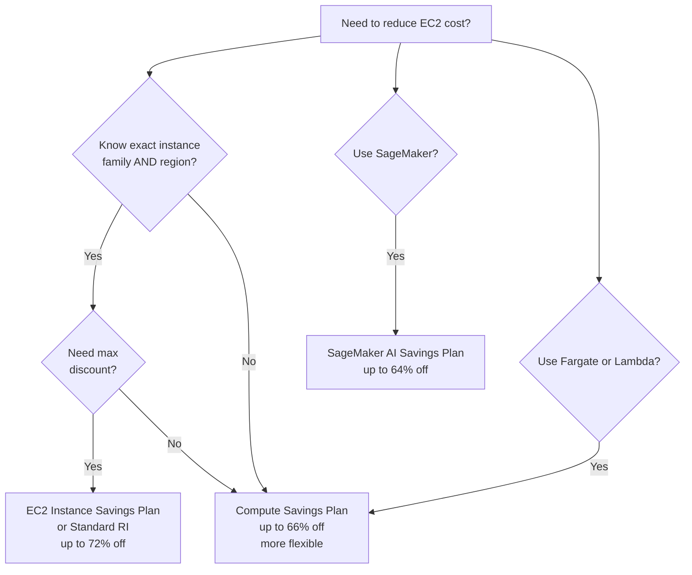
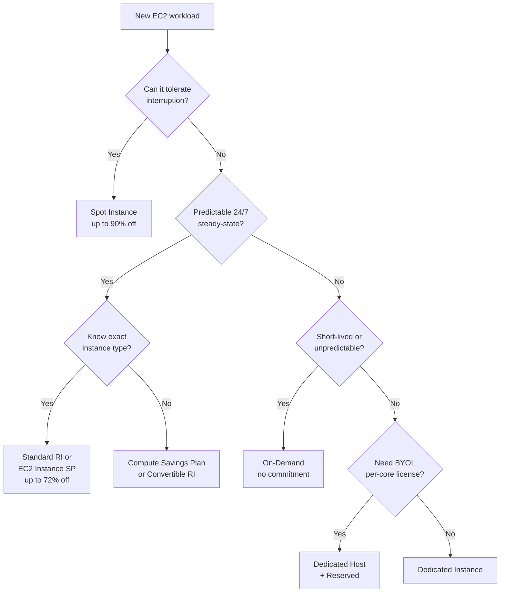
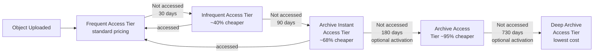
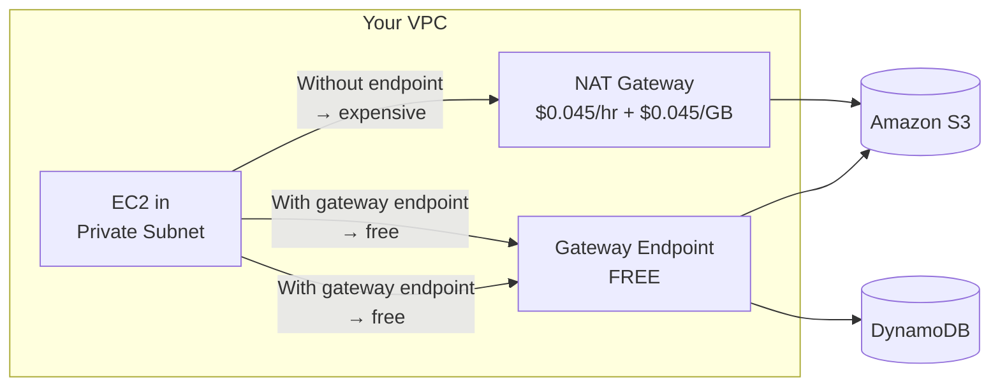
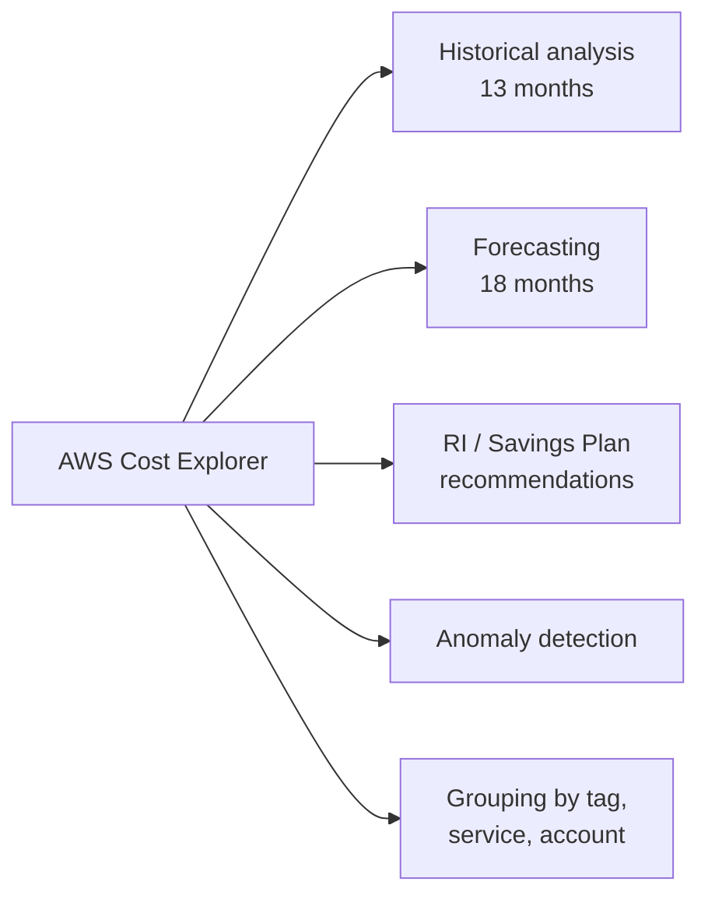

# Domain 4: Design Cost-Optimized Architectures

> **Exam weight: 20% of SAA-C03** — roughly 13 questions out of 65. Scenarios test your ability to pick the cheapest option that still meets stated requirements around availability, performance, and commitment level.

Cost optimization on AWS is not about buying the cheapest thing — it's about matching spending to actual need. AWS gives you levers at every layer: how you buy compute, which storage class you use, how traffic flows through your network, and how you measure and govern all of it.

> **Plain English:** "You have a steady web server running 24/7 — what's cheapest?" → Reserved Instance or Savings Plan. "Batch job that can restart if interrupted?" → Spot. "Logs you never read after 90 days?" → Glacier. "EC2 instances talking to S3 — want to eliminate NAT Gateway bills?" → Gateway VPC Endpoint (free). "Boss wants a weekly email if cloud bill exceeds $500?" → AWS Budget with email alert.

---

## Table of Contents

1. [Compute Pricing Models](#1-compute-pricing-models)
2. [Right-Sizing with AWS Compute Optimizer](#2-right-sizing-with-aws-compute-optimizer)
3. [Cost-Optimized Storage](#3-cost-optimized-storage)
4. [Cost-Optimized Databases](#4-cost-optimized-databases)
5. [Networking and Data Transfer Costs](#5-networking-and-data-transfer-costs)
6. [Cost Management and Governance Tools](#6-cost-management-and-governance-tools)
7. [Glossary](#glossary)
8. [References](#references)

---

## 1. Compute Pricing Models

AWS offers seven ways to purchase EC2 compute. The right choice depends on three questions: **How long will you need it? Can it be interrupted? Can you predict the instance type you'll use?** ([EC2 billing and purchasing options](https://docs.aws.amazon.com/AWSEC2/latest/UserGuide/instance-purchasing-options.html))

### 1.1 On-Demand Instances

Pay **per second** (Linux) or per hour (Windows) for running instances with no long-term commitment. Highest unit price of all options.

> **Why (the rationale):** Eliminates commitment risk entirely — you pay only while the instance runs, making it the right baseline before you have utilization data to commit to RIs or Savings Plans.
> **When to use:** Unpredictable or bursty workloads, short experiments, new applications where usage patterns are unknown, or as overflow capacity beyond your committed baseline.
> **Nuances & gotchas:** On-Demand is the most expensive per-hour option — running an On-Demand instance 24/7 for a year costs ~3× more than the equivalent 3-year All-Upfront Standard RI. There is no free cancellation grace period; charges accrue by the second (Linux) from the moment the instance starts.

- **When to use:** Unpredictable workloads, short-lived experiments, traffic spikes you can't forecast, first time deploying an application before you know utilization patterns.
- **Key trait:** No commitment, no discount. You can start/stop at any time.

### 1.2 Reserved Instances (RI)

A **billing discount** (not a physical reservation unless you choose zonal scope) applied to matching On-Demand usage in exchange for a 1-year or 3-year commitment. Discounts reach up to **72% off On-Demand** pricing. ([Reserved Instances overview](https://docs.aws.amazon.com/AWSEC2/latest/UserGuide/ec2-reserved-instances.html))

> **Why (the rationale):** Dramatically reduces cost for steady-state workloads you can confidently plan 1–3 years ahead; the discount is applied automatically as a billing credit — you don't need to launch a special instance type.
> **When to use:** Production servers, databases, or any resource running continuously 24/7 where the instance family and Region are known and unlikely to change.
> **Nuances & gotchas:** An RI is a **billing construct, not a capacity reservation** (unless you choose Zonal scope). Regional RIs do NOT guarantee capacity. If you stop the matching instance, the RI hourly charge still accrues — you pay whether or not the instance is running. Standard RIs can be sold on the RI Marketplace; Convertible RIs cannot. AWS now recommends Savings Plans over RIs for most new commitments.

#### Offering Classes — Standard vs Convertible

> **Why (the rationale):** Standard RIs give the deepest discount but lock you to an instance family; Convertible RIs trade a smaller discount for the ability to exchange to a different family, OS, or tenancy — useful when migration to newer instance generations is likely.
> **When to use:** Standard RI when the workload is stable and you're confident in the instance family (e.g., m5 today and m5 in 3 years). Convertible RI when you expect to shift families (e.g., m5 → m7g Graviton) or OS during the term.
> **Nuances & gotchas:** Convertible RIs give up to ~54% discount vs Standard's ~72% — that's a real gap. Convertible RIs cannot be resold on the RI Marketplace. "Modify" (change AZ or size within same family) is allowed for both; "Exchange" (change family/OS) is only for Convertible.

| Feature | Standard RI | Convertible RI |
|---|---|---|
| Max discount | Higher (up to ~72%) | Lower (up to ~54%) |
| Can exchange for different instance attributes | No | Yes |
| Can modify (size, AZ within same family) | Yes | Yes |
| Can sell on RI Marketplace | Yes | No |
| Best for | Known, stable workloads | Workloads where instance family may change |

#### Payment Options

| Option | Upfront cost | Hourly charge | Savings vs No Upfront |
|---|---|---|---|
| All Upfront | Full term amount | $0 | Highest savings |
| Partial Upfront | Portion upfront | Reduced hourly | Middle |
| No Upfront | $0 | Discounted hourly | Lowest savings |

> Note: AWS recommends Savings Plans over Reserved Instances for most new commitments due to greater flexibility. ([EC2 RI docs](https://docs.aws.amazon.com/AWSEC2/latest/UserGuide/ec2-reserved-instances.html))

#### Scope: Regional vs Zonal

> **Why (the rationale):** Zonal scope adds a capacity reservation guarantee in addition to the billing discount — critical if you need assurance that capacity will be available (e.g., disaster recovery standby instances). Regional scope is more flexible but provides no capacity guarantee.
> **When to use:** Regional RI for most workloads (maximize flexibility across AZs). Zonal RI when you need guaranteed capacity in a specific AZ, such as a warm standby instance for DR.
> **Nuances & gotchas:** Regional RIs provide the instance-size flexibility benefit (a regional m5 RI can cover m5.large or m5.xlarge usage proportionally); Zonal RIs do NOT have size flexibility — they only apply to the exact instance size purchased.

- **Regional RI** — applies discount across all AZs in a Region for the instance family; no capacity reservation.
- **Zonal RI** — applies to a specific AZ and also **reserves capacity** in that AZ (useful for disaster recovery).

### 1.3 Savings Plans

A commitment to spend a **fixed dollar amount per hour** (e.g., $10/hr) for 1 or 3 years, in exchange for discounted rates. More flexible than RIs because the discount auto-applies as long as you hit the committed spend level. ([What are Savings Plans?](https://docs.aws.amazon.com/savingsplans/latest/userguide/what-is-savings-plans.html))

> **Why (the rationale):** Savings Plans decouple your commitment from a specific instance configuration — you commit to a spend rate ($/hr), not a specific instance type or Region, so the discount follows your usage automatically as infrastructure evolves.
> **When to use:** Prefer Savings Plans over RIs for new commitments when you have consistent baseline spend but may change instance families, Regions, or even move workloads between EC2, Fargate, and Lambda.
> **Nuances & gotchas:** Usage beyond your committed $/hr is charged at On-Demand rates. Compute Savings Plans are the most flexible (any Region/family/Fargate/Lambda) but offer up to 66% off; EC2 Instance Savings Plans lock you to a specific instance family + Region for a slightly higher discount (up to 72%). Savings Plans do NOT provide capacity reservations — unlike Zonal RIs, they are purely a billing instrument.

#### The Four Savings Plan Types

| Plan Type | Max Discount | Applies To | Flexibility |
|---|---|---|---|
| **Compute Savings Plans** | Up to 66% off On-Demand | EC2 (any family/size/OS/region/tenancy), Fargate, Lambda | Maximum — switch instance family, region, OS, or move EC2 → ECS/Lambda freely |
| **EC2 Instance Savings Plans** | Up to 72% off On-Demand | Specific EC2 instance family in a specific Region | Can change size/OS/tenancy within the committed family+Region |
| **SageMaker AI Savings Plans** | Up to 64% off On-Demand | SageMaker instance usage (Training, Inference, Notebooks) | Any family/size/component/region |
| **Database Savings Plans** | Up to 35% off On-Demand | Aurora, RDS, DynamoDB, ElastiCache, DocumentDB, Neptune, and more | Any engine, family, size, AZ, or Region; includes serverless |

([Savings Plans types](https://docs.aws.amazon.com/savingsplans/latest/userguide/plan-types.html))



### 1.4 Spot Instances

Bid on **spare AWS capacity** at up to **90% off On-Demand** pricing. AWS can reclaim Spot Instances with a **2-minute warning** (interruption notice). ([EC2 purchasing options](https://docs.aws.amazon.com/AWSEC2/latest/UserGuide/instance-purchasing-options.html))

> **Why (the rationale):** Spot leverages unused AWS capacity at massive discounts — up to 90% off On-Demand — making it ideal for workloads that can tolerate sudden termination without losing critical state.
> **When to use:** Fault-tolerant, stateless, or checkpointable workloads: batch jobs, EMR processing, CI/CD pipelines, ML training with checkpointing, video rendering, and stateless web tier behind a load balancer.
> **Nuances & gotchas:** Spot Instances can be reclaimed with only a **2-minute warning** — this is non-negotiable and AWS does not guarantee uninterrupted runtime. NEVER use Spot for primary databases, stateful applications, or anything lacking a checkpoint/restart strategy. Spot pricing fluctuates by instance type and AZ — use Spot Instance Advisor to find types with low interruption frequency. Spot does NOT support hibernate on all instance types; check before relying on it.

#### Interruption Handling

- Configure interruption behavior: **terminate** (default), **stop**, or **hibernate**.
- Use **Spot Instance Advisor** to choose instance types with low interruption frequency.
- **Spot Fleet** — request a mix of instance types and AZs to maintain a target capacity; automatically replaces interrupted instances.
- **EC2 Auto Scaling with mixed instances** — combine On-Demand base capacity with Spot for cost + availability.

#### Ideal Workloads for Spot

- Big data / EMR processing
- CI/CD build pipelines
- Stateless web tier (behind a load balancer)
- Batch jobs / ML training (with checkpointing)
- Video transcoding, image rendering

**Never use Spot for:** databases, stateful applications, anything that cannot tolerate interruption without a checkpoint/restart strategy.

### 1.5 Dedicated Hosts vs Dedicated Instances

> **Why (the rationale):** Both options place your instances on single-tenant hardware for compliance or licensing reasons, but Dedicated Hosts additionally give you **visibility into the physical server** (socket/core counts), which is required to use Bring Your Own License (BYOL) software tied to physical cores or sockets.
> **When to use:** Dedicated Host when you have per-socket or per-core software licenses (Windows Server, SQL Server, RHEL, Oracle). Dedicated Instance when compliance mandates single-tenant hardware but license portability is not needed.
> **Nuances & gotchas:** Dedicated Instances have a $2/Region/hr surcharge on top of per-instance charges (regardless of how many instances). Dedicated Hosts bill per-host, which can be more cost-effective at high density. Dedicated Hosts can be Reserved (up to ~70% vs On-Demand host price). Neither option is the same as a capacity reservation — they isolate tenancy, not guarantee supply.

| Feature | Dedicated Host | Dedicated Instance |
|---|---|---|
| What you pay for | Entire physical server | Individual instances on single-tenant hardware |
| Visibility into host | Yes (socket, core, VM counts) | No |
| BYOL support | Yes — per-socket or per-core licenses | Limited |
| Can be reserved | Yes (up to 70% savings vs On-Demand host) | Yes |
| Cost model | Per-host billing | Per-instance billing (+ $2/Region/hr fee) |
| Use case | Windows Server, SQL Server, RHEL licenses tied to physical cores | Compliance requiring single-tenant hardware without needing license portability |

([EC2 Dedicated Hosts billing](https://docs.aws.amazon.com/AWSEC2/latest/UserGuide/dedicated-hosts-billing.html))

### 1.6 Pricing Model Decision Tree



### 🎯 On the exam — Compute Pricing

- **"Steady-state 24/7 usage, want maximum discount, know exact instance type"** → Standard Reserved Instance (All Upfront, 3-year) or EC2 Instance Savings Plan.
- **"Fault-tolerant batch processing, cheapest possible"** → Spot Instances.
- **"Unpredictable spike traffic, no commitment"** → On-Demand.
- **"Workload may switch from m5 to c5 or move region"** → Compute Savings Plan (more flexible than RI).
- **"Need to run Windows Server license tied to physical cores"** → Dedicated Host.
- **"Convertible vs Standard RI"** → Standard = higher discount but no exchange; Convertible = can exchange for different attributes, lower discount.
- **"Savings Plans vs RI"** → Savings Plans commit to $/hr spend; RIs commit to specific instance config. AWS now recommends Savings Plans.
- **Trap:** Spot Instances are NOT suitable for RDS, primary databases, or workloads without interruption handling.

---

## 2. Right-Sizing with AWS Compute Optimizer

[AWS Compute Optimizer](https://aws.amazon.com/compute-optimizer/) uses **machine learning on CloudWatch metrics** to identify over-provisioned and under-provisioned resources and recommends optimal configurations.

> **Why (the rationale):** Most teams provision EC2 at peak load and never revisit sizing — Compute Optimizer analyzes actual CloudWatch utilization and recommends the smallest instance that still meets performance needs, often cutting costs 20–40% with zero application changes.
> **When to use:** Before purchasing RIs or Savings Plans (right-size first, then commit), when reviewing idle or low-CPU instances, when evaluating a Graviton ARM migration for cost/performance gains.
> **Nuances & gotchas:** Compute Optimizer needs at least 30 hours of CloudWatch data before producing recommendations (14 days is the recommended window for stable suggestions). Without the CloudWatch Agent installed, recommendations are based on CPU only — memory utilization is invisible, leading to potentially incorrect downsizing recommendations for memory-bound workloads. Opt-in is required per account (or via AWS Organizations). Compute Optimizer does NOT show spend — use Cost Explorer for that.

### What It Analyzes

| Resource | Recommendation Type |
|---|---|
| EC2 instances | Right-size to smaller/larger type, migrate to Graviton |
| EC2 Auto Scaling groups | Adjust desired/min/max capacity |
| EBS volumes | Change volume type (e.g., io1 → gp3) |
| RDS DB instances | Right-size instance class |
| AWS Graviton migration | Estimates performance risk and savings for ARM migration |
| Idle resources | Identify unattached EBS volumes, idle EC2 instances |

### Key Behaviors

- Analyzes **14 days** of CloudWatch metrics by default.
- Requires **opting in** per account (or via AWS Organizations for bulk enrollment).
- Provides **savings opportunity score** and estimated monthly savings.
- Enhanced recommendations available with **CloudWatch Agent** installed (memory utilization data, otherwise CPU-only).
- Can automatically implement recommendations on a recurring schedule.

### 🎯 On the exam — Compute Optimizer

- **"Need to identify over-provisioned EC2 instances"** → AWS Compute Optimizer.
- **"Reduce EC2 spend without changing application"** → Compute Optimizer for right-sizing, then buy Savings Plan/RI for resulting instance type.
- Compute Optimizer ≠ Cost Explorer. Cost Explorer shows spend; Compute Optimizer shows **what to change**.
- **Trap:** Compute Optimizer needs sufficient CloudWatch data (at least 30 hours, recommends 14 days). New instances have no recommendations immediately.

---

## 3. Cost-Optimized Storage

### 3.1 S3 Storage Classes

Choose the storage class based on **access frequency**, **retrieval time requirements**, and **minimum storage duration**. ([S3 storage classes](https://aws.amazon.com/s3/storage-classes/), [S3 storage class docs](https://docs.aws.amazon.com/AmazonS3/latest/userguide/storage-class-intro.html))

> **Why (the rationale):** S3 stores data at identical durability (11 nines) across all classes — the tiers exist purely to trade higher storage cost for lower retrieval cost (Standard) vs lower storage cost for higher retrieval cost (IA/Glacier). Matching the class to access frequency avoids paying for retrieval speed you never use, or paying Standard prices for data that's never read.
> **When to use:** Standard for hot data; Standard-IA/One Zone-IA for infrequently accessed data where instant retrieval is still needed; Glacier classes for archival where retrieval delays are acceptable; Intelligent-Tiering when access patterns are genuinely unknown.
> **Nuances & gotchas:** Every IA and Glacier class has a **minimum storage duration** — you pay the full minimum even if you delete the object early (Standard-IA/One Zone-IA: 30 days; Glacier Instant/Flexible: 90 days; Deep Archive: 180 days). One Zone-IA stores data in a **single AZ** — data is permanently lost if that AZ is destroyed (unlike all other classes which span ≥3 AZs). Retrieval fees apply for all IA and Glacier classes per GB retrieved; Standard and Intelligent-Tiering have no retrieval fees.

| Storage Class | Min Duration | Retrieval Latency | Retrieval Fee | Durability | AZs | Best For |
|---|---|---|---|---|---|---|
| **S3 Standard** | None | Milliseconds | None | 11 9s | ≥3 | Frequently accessed data |
| **S3 Intelligent-Tiering** | None | Milliseconds (auto) | None\* | 11 9s | ≥3 | Unknown/changing access patterns |
| **S3 Standard-IA** | 30 days | Milliseconds | Per GB | 11 9s | ≥3 | Infrequent access, instant retrieval needed |
| **S3 One Zone-IA** | 30 days | Milliseconds | Per GB | 11 9s | 1 | Non-critical infrequent access, ~20% cheaper than Standard-IA |
| **S3 Glacier Instant Retrieval** | 90 days | Milliseconds | Per GB | 11 9s | ≥3 | Archive accessed a few times per year, instant retrieval |
| **S3 Glacier Flexible Retrieval** | 90 days | Minutes–hours | Per GB | 11 9s | ≥3 | Backup/archive, rarely accessed, flexible retrieval |
| **S3 Glacier Deep Archive** | 180 days | 12–48 hours | Per GB | 11 9s | ≥3 | Long-term compliance archive, lowest cost |

\*S3 Intelligent-Tiering has a small monthly **monitoring and automation charge** per object but **no retrieval charges**.

#### S3 Intelligent-Tiering Auto-Tiering Logic



**Key Intelligent-Tiering rules:**

> **Why (the rationale):** Intelligent-Tiering eliminates the need to predict access patterns — it automatically moves objects to cheaper tiers as access frequency drops, with no retrieval fee penalty, making it the default choice when access patterns are unknown or change over time.
> **When to use:** Data lakes, user-generated content, long-lived objects whose access is unpredictable, or any bucket where you'd otherwise have to guess between Standard and Standard-IA.
> **Nuances & gotchas:** Intelligent-Tiering charges a small **per-object monitoring and automation fee** (~$0.0025 per 1,000 objects/month) — this makes it uneconomical for buckets containing many tiny objects (e.g., millions of files under a few KB each) where the monitoring fee exceeds storage savings. Objects smaller than 128 KB are **not eligible for tiering** and always remain in the Frequent Access tier, so you pay Standard pricing for those. The Archive Access and Deep Archive Access tiers are **opt-in** and must be explicitly activated.

- No retrieval fees — you never pay more for accessing an object in a lower tier.
- No minimum object size requirement (but small objects < 128 KB are not monitored and stay in Frequent Access).
- Objects automatically move back to Frequent Access tier when accessed.

#### S3 Pricing Tier Order (highest to lowest cost per GB stored)

```
S3 Standard > S3 Intelligent-Tiering (Frequent) > S3 Standard-IA > S3 One Zone-IA
> S3 Glacier Instant Retrieval > S3 Glacier Flexible Retrieval > S3 Glacier Deep Archive
```

### 3.2 S3 Lifecycle Policies

[S3 Lifecycle configuration](https://docs.aws.amazon.com/AmazonS3/latest/userguide/object-lifecycle-mgmt.html) automates transitions and deletions without application changes.

> **Why (the rationale):** Data access naturally drops over time — logs, backups, and reports are read frequently at first, then rarely. Lifecycle policies encode that decay automatically, moving objects to progressively cheaper tiers and eventually deleting them, without any application code change.
> **When to use:** Whenever data has a predictable aging pattern: application logs, CloudTrail logs, backups, compliance archives, old database exports. Combine with versioning to expire old object versions and delete markers automatically.
> **Nuances & gotchas:** Transitions can only move **downward** in the cost tier — you cannot transition objects from Standard-IA back to Standard via a lifecycle rule. There is a mandatory **30-day minimum in Standard** before transitioning to Standard-IA or One Zone-IA, and a **30-day minimum in Standard-IA** before transitioning to Glacier classes (except for new objects going directly to Glacier via transition on Day 0+). Deleting an object before its minimum storage duration still bills the full minimum (e.g., deleting a Glacier Deep Archive object on day 10 still charges 180 days).

**Two action types:**
1. **Transition actions** — move objects to a cheaper storage class after N days.
2. **Expiration actions** — delete objects after N days (or delete old versions, expired delete markers).

**Common lifecycle pattern:**

```
Day 0:    S3 Standard          ← hot data, frequent access
Day 30:   → S3 Standard-IA    ← access frequency drops
Day 90:   → S3 Glacier Flexible Retrieval  ← rarely accessed
Day 365:  → S3 Glacier Deep Archive        ← compliance retention
Day 2555: DELETE               ← end of 7-year retention
```

**Important constraints:**
- You cannot transition from Standard-IA / One Zone-IA to Standard (only downward in tier).
- Minimum 30 days in Standard before transitioning to Standard-IA / One Zone-IA.
- Minimum 30 days in Standard-IA before transitioning to Glacier classes.
- If an object is deleted before its minimum storage duration, you still pay the minimum.

### 3.3 S3 Storage Lens

[S3 Storage Lens](https://docs.aws.amazon.com/AmazonS3/latest/userguide/storage_lens.html) provides organization-wide visibility into object storage usage and activity trends.

> **Why (the rationale):** At scale, S3 costs are dominated by hidden waste — buckets with millions of noncurrent versions, stalled multipart uploads, or Standard-class objects never accessed. Storage Lens surfaces these across all accounts and buckets in an organization without manual bucket-by-bucket inspection.
> **When to use:** When managing S3 at organizational scale, before designing lifecycle policies (to understand actual access patterns), or when an S3 cost spike appears and you need to identify the source bucket/prefix.
> **Nuances & gotchas:** The free tier provides 28 usage metrics with 14-day retention — this covers basic size and object count. Advanced metrics (activity, prefix-level, CloudWatch publishing) require the **paid advanced tier**. Storage Lens is an **observability tool**, not an action tool — it identifies candidates for lifecycle rules but does NOT create or apply lifecycle policies itself. Data appears with a latency of up to 48 hours.

- **Free tier:** 28 usage metrics, 14-day data retention.
- **Advanced metrics (paid):** activity metrics, prefix-level metrics, CloudWatch publishing.
- Identifies buckets with large amounts of noncurrent versions, incomplete multipart uploads, and objects in Standard that haven't been accessed — prime candidates for lifecycle rules.

### 3.4 EBS: gp3 vs gp2

[Amazon EBS pricing](https://aws.amazon.com/ebs/pricing/) — gp3 is the current-generation general purpose SSD, replacing gp2.

> **Why (the rationale):** gp3 decouples IOPS and throughput from volume size, letting you tune performance independently and at lower base cost (~20% cheaper per GB than gp2). For most gp2 volumes, migrating to gp3 delivers equal or better performance at lower cost with zero downtime.
> **When to use:** For any new EBS volume needing general-purpose SSD performance; migrate existing gp2 volumes to gp3 as a quick cost-reduction action. Use io2/io1 only when you need more than 16,000 IOPS or sub-millisecond latency guarantees.
> **Nuances & gotchas:** On gp2, IOPS scale with volume size (3 IOPS/GB) — so teams often over-provision volume size just to get enough IOPS, wasting storage cost. gp3 provides 3,000 IOPS and 125 MB/s **included at no extra charge regardless of size**. Additional IOPS beyond 3,000 on gp3 cost ~$0.005/IOPS-month; additional throughput beyond 125 MB/s costs ~$0.04/MB/s-month — verify your workload doesn't need these extras before assuming gp3 is always cheaper for high-IOPS volumes.

| Feature | gp2 | gp3 |
|---|---|---|
| Pricing (us-east-1) | ~$0.10/GB-month | ~$0.08/GB-month (~20% cheaper) |
| Baseline IOPS | 3 IOPS/GB (min 100, max 16,000) | **3,000 IOPS included free** |
| Baseline throughput | Up to 250 MB/s (tied to size) | **125 MB/s included free** |
| Max IOPS | 16,000 | 16,000 |
| Max throughput | 250 MB/s | 1,000 MB/s |
| IOPS scaling | Coupled to volume size | **Independently configurable** |
| Additional IOPS cost | N/A (bundled) | ~$0.005/provisioned IOPS-month (above 3,000) |
| Additional throughput cost | N/A | ~$0.04/provisioned MB/s-month (above 125 MB/s) |

**Migration tip:** Most gp2 volumes can be migrated to gp3 with the same or better performance at **lower cost** — no downtime required.

#### EBS Snapshots and Data Lifecycle Manager (DLM)

> **Why (the rationale):** EBS snapshots are incremental (only changed blocks) and stored in S3 managed by AWS — they provide a low-cost point-in-time backup without per-snapshot full-copy pricing. DLM automates the create/retain/delete lifecycle so old snapshots don't silently accumulate and inflate costs.
> **When to use:** Enable DLM snapshot policies for any production EBS volume. Use cross-region snapshot copies for DR. Archive old snapshots to EBS Snapshot Archive tier (65% cheaper) for snapshots needed for compliance but rarely restored.
> **Nuances & gotchas:** Snapshots are incremental, but deleting an intermediate snapshot does NOT lose data — AWS reconstructs the chain. However, accumulated snapshots over months/years can become a significant cost center if DLM retention policies aren't enforced. Cross-region snapshot copies incur **data transfer charges** (the copy itself) plus storage costs in the destination region. Snapshots are NOT visible in your S3 console — they are AWS-managed S3.

- Snapshots are stored in S3 (managed by AWS, not visible in your S3 console).
- Priced per GB-month of data stored; **incremental** — only changed blocks since last snapshot.
- **Data Lifecycle Manager (DLM)** automates snapshot creation, retention, and deletion on schedules.
- Cross-region snapshot copies incur data transfer charges.

### 3.5 EFS Infrequent Access

[Amazon EFS pricing](https://aws.amazon.com/efs/pricing/) offers tiered storage:

> **Why (the rationale):** EFS Standard is priced for actively-used files; EFS IA is 85–92% cheaper per GB for cold files that are rarely read. EFS Lifecycle Management moves files automatically based on last-access time — no application change needed.
> **When to use:** Any EFS file system containing a mix of hot and cold files: home directories, shared application data, content repositories, log archives. Enable lifecycle management on Day 1 with a 30-day or 60-day threshold.
> **Nuances & gotchas:** Accessing a file in EFS IA incurs a **per-GB retrieval fee** — frequent access to IA-tiered files negates the storage savings. EFS IA does NOT change throughput mode or performance characteristics; files remain accessible with the same APIs. The EFS Archive tier (cheapest) is for files accessed only a few times per year; accessing it has a higher retrieval fee than IA. Lifecycle Management moves files **back to Standard** if they are accessed (preventing stuck-in-IA performance issues).

| EFS Tier | Use Case | Storage Cost Relative to Standard |
|---|---|---|
| **EFS Standard** | Actively used files, sub-millisecond latency | Baseline |
| **EFS Infrequent Access (IA)** | Files accessed a few times per quarter | ~85–92% cheaper per GB |
| **EFS Archive** | Files accessed a few times per year or less | Cheapest |

- **EFS Lifecycle Management** automatically moves files between tiers based on last-access time (configurable: 7, 14, 30, 60, or 90 days without access → IA).
- Retrieval fee applies when accessing IA/Archive data.
- Works with both **Elastic** (auto-scale throughput) and **Provisioned** throughput modes.

### 🎯 On the exam — Storage

- **"Unknown or changing access patterns"** → S3 Intelligent-Tiering (no retrieval charge, auto-tiering).
- **"Archive accessed only a few times per year, need instant retrieval"** → S3 Glacier Instant Retrieval.
- **"Long-term compliance archive, 7-year retention, retrieval in hours OK"** → S3 Glacier Deep Archive (lowest cost).
- **"Reduce cost of infrequently accessed data but can't tolerate multi-AZ loss"** → S3 One Zone-IA (20% cheaper than Standard-IA, single AZ).
- **"Automate moving S3 objects to cheaper tiers without code changes"** → S3 Lifecycle Policy.
- **"Reduce EBS costs without changing performance"** → Migrate gp2 → gp3 (same IOPS, ~20% cheaper per GB).
- **"Automate EBS snapshot retention"** → Data Lifecycle Manager (DLM).
- **"EFS — files not accessed for 30 days should cost less"** → Enable EFS Lifecycle Management → EFS IA.
- **Trap:** S3 Standard-IA and One Zone-IA have a **30-day minimum storage** — deleting before 30 days still charges you for 30 days. Glacier Instant/Flexible: 90-day minimum. Deep Archive: 180-day minimum.
- **Trap:** One Zone-IA data is in a single AZ — data is **lost** if that AZ is destroyed.

---

## 4. Cost-Optimized Databases

### 4.1 Aurora Serverless v2

[Amazon Aurora Serverless v2](https://aws.amazon.com/rds/aurora/pricing/) scales compute capacity in fine-grained increments of **Aurora Capacity Units (ACUs)**. You pay only for the ACUs used per second.

> **Why (the rationale):** Provisioned Aurora requires you to size for peak load and pay 24/7 — Aurora Serverless v2 scales compute instantly in fine-grained ACU increments (0.5 ACU steps), so you pay for actual load rather than worst-case headroom.
> **When to use:** Development/test databases, SaaS multi-tenant apps with variable per-tenant load, applications with unpredictable traffic spikes, and any scenario where provisioning for peak would mean paying 5–10× average load.
> **Nuances & gotchas:** Scale-to-zero (min ACU = 0) is supported but the **default minimum is 0.5 ACU** — you must explicitly set minimum to 0 to eliminate compute cost during idle periods. Scaling up is fast (seconds) but there can be a brief latency spike during a large scale-out event. Aurora Serverless v2 does **not** share the same connection pooling limitations as v1 — it supports all Aurora features (read replicas, Global Database, Multi-AZ). Storage is billed separately per GB-month regardless of ACU usage.

- **Scale-to-zero:** Aurora Serverless v2 supports scaling down to 0 ACUs during periods of inactivity, eliminating compute cost when the database is idle.
- **Savings vs provisioned:** Up to **90% cost reduction** compared to provisioning for peak load.
- **Use case:** Development/test databases, variable workloads, SaaS applications with unpredictable per-tenant traffic.
- Billed per ACU-hour; storage billed separately per GB-month.

### 4.2 DynamoDB: On-Demand vs Provisioned Capacity

[DynamoDB pricing](https://aws.amazon.com/dynamodb/pricing/) offers two capacity modes: ([DynamoDB docs](https://aws.amazon.com/dynamodb/pricing/))

> **Why (the rationale):** DynamoDB On-Demand eliminates capacity planning and throttling at the cost of a higher per-request price; Provisioned mode is cheaper per RCU/WCU when traffic is predictable and steady, especially combined with Reserved Capacity discounts.
> **When to use:** On-Demand for new tables (unknown traffic), dev/test environments, event-driven or spiky workloads, and serverless apps. Provisioned + Auto Scaling for steady production tables; add Reserved Capacity once the baseline WCU/RCU usage is stable over months.
> **Nuances & gotchas:** On-Demand is priced per **request unit** (RRU/WRU) and can cost 5–7× more than equivalent Provisioned usage at high, steady throughput. DynamoDB On-Demand has a default throughput limit per table (throttling applies on sudden spikes beyond 2× the previous peak); it is NOT unlimited — you can request limit increases. Reserved Capacity discounts (up to 77% for 3-year) apply **only to Provisioned mode** — you cannot combine Reserved Capacity with On-Demand mode.

| Mode | Billing Unit | Best For | Notes |
|---|---|---|---|
| **On-Demand** | Per request (RRU/WRU) | New tables, unpredictable workloads, serverless apps | No capacity planning needed; higher per-request cost |
| **Provisioned + Auto Scaling** | Per provisioned RCU/WCU-hour | Predictable steady-state traffic | Auto Scaling adjusts capacity to target utilization (default 70%) |
| **Reserved Capacity (Provisioned only)** | 1-year or 3-year commitment | Stable baseline throughput | Up to 54% (1-year) or 77% (3-year) discount vs On-Demand |

**DynamoDB Free Tier:** 25 WCUs, 25 RCUs, 25 GB storage per month (does not expire).

**Read unit pricing:**
- Eventually consistent read: 0.5 RRU per 4 KB
- Strongly consistent read: 1 RRU per 4 KB
- Transactional read: 2 RRUs per 4 KB

### 4.3 RDS Reserved Instances

[Amazon RDS Reserved Instances](https://aws.amazon.com/rds/pricing/) follow the same model as EC2 RIs — commit to an instance class, database engine, and Region for 1 or 3 years in exchange for significant discounts vs On-Demand.

> **Why (the rationale):** Production RDS databases run 24/7 with a stable instance class — the same commitment logic as EC2 RIs applies, delivering substantial discounts (up to ~69% for 3-year All Upfront) for workloads that don't change.
> **When to use:** Any RDS instance in production running continuously, once the instance class, engine, and Region are confirmed stable. Apply after right-sizing (use Compute Optimizer or Performance Insights before committing).
> **Nuances & gotchas:** RDS RIs commit to a specific **instance class and database engine** — an RI for db.m5.large PostgreSQL does NOT apply to db.m5.large MySQL. Unlike EC2 RIs, there are **no Convertible RDS RIs** — you cannot exchange to a different engine or family mid-term. Multi-AZ deployments require purchasing an RI that covers Multi-AZ (priced higher than Single-AZ RIs). The RI discount does NOT cover storage, I/O, or data transfer charges — only the DB instance compute cost.

- Available in **No Upfront**, **Partial Upfront**, and **All Upfront** options.
- Supports Multi-AZ deployments (separate RI needed for standby if provisioned separately).
- RDS Reserved Instances are a good fit when you have a stable, production database that runs continuously.

### 4.4 Redshift RA3 + Pause/Resume

[Amazon Redshift RA3 nodes](https://aws.amazon.com/redshift/pricing/) **decouple compute from storage** using Redshift Managed Storage (RMS), billed separately:

> **Why (the rationale):** Legacy Redshift ds2/dc2 nodes bundle compute and storage — you can't scale one without the other. RA3 decouples them, so you can scale compute up for heavy query periods and scale back down (or pause entirely) without affecting your data, cutting costs for intermittent analytics workloads.
> **When to use:** Data warehouse clusters where data size exceeds local node storage capacity, where compute needs vary (e.g., heavy end-of-month reporting vs light daily queries), or where the cluster is idle nights and weekends (use Pause/Resume to stop compute billing).
> **Nuances & gotchas:** Pause/Resume only stops **compute billing** — you continue paying for Redshift Managed Storage (~$0.024/GB-month) while paused. Pause/Resume is available for **on-demand provisioned clusters only** — Reserved Node clusters cannot be paused (the RI charge continues regardless). RA3 nodes support Redshift Spectrum (query S3 directly), which can further reduce the data that needs to be loaded into RMS.

- **Compute:** Billed per node-hour when the cluster is running.
- **Storage:** Billed per GB-month at a fixed rate (~$0.024/GB-month for RMS) regardless of how much data fits on nodes.
- **Pause/Resume:** For on-demand provisioned clusters, you can pause the cluster to suspend compute billing. During pause, you pay **only for backup storage** — ideal for dev/test clusters used during business hours only.
- RA3 is optimal when your data size exceeds what fits on compute nodes, or when you want to scale compute up/down independently of data size.

### 🎯 On the exam — Databases

- **"Variable database load, don't want to manage capacity"** → Aurora Serverless v2.
- **"DynamoDB — traffic spikes unpredictably"** → On-Demand capacity mode.
- **"DynamoDB — steady, predictable traffic, want to reduce cost"** → Provisioned + Auto Scaling + Reserved Capacity.
- **"RDS MySQL production server running 24/7"** → RDS Reserved Instance (All Upfront, 1 or 3 year).
- **"Redshift cluster only used 8 hours/day during business hours"** → Pause cluster outside hours to stop compute charges.
- **Trap:** Aurora Serverless v2 scale-to-zero requires minimum ACU set to 0 (not the default) — verify this is configured.

---

## 5. Networking and Data Transfer Costs

Data transfer is often the **hidden cost** in AWS architectures. Understanding where charges apply is critical for the exam.

### 5.1 Data Transfer Pricing Rules

([Data transfer cost overview](https://aws.amazon.com/blogs/architecture/overview-of-data-transfer-costs-for-common-architectures/))

> **Why (the rationale):** Data transfer charges are invisible at design time but can exceed compute costs in data-heavy architectures. Understanding which traffic paths are free vs charged lets you architect to keep data on free paths (same-AZ, gateway endpoints, AWS internal) and avoid surprises.
> **When to use (this knowledge):** Any time you're designing multi-AZ, multi-Region, or hybrid architectures, or when services communicate via load balancers, NAT Gateways, or VPNs across AZ boundaries.
> **Nuances & gotchas:** Cross-AZ traffic is charged **in both directions** (~$0.01/GB each way = ~$0.02/GB round-trip) — chatty microservices spread across AZs can generate significant unexpected charges. Keeping all high-bandwidth inter-service traffic within a single AZ eliminates these charges. EC2-to-S3 in the same region via the internet gateway is free; routing the same traffic through a NAT Gateway adds ~$0.045/GB in data processing fees. Data INTO AWS from the internet is always free.

| Traffic Type | Cost |
|---|---|
| **Data IN to AWS** (from internet or on-premises) | **Free** |
| **Within same AZ** (between instances) | **Free** |
| **Cross-AZ within same Region** | Charged per GB (~$0.01/GB each direction) |
| **Cross-Region** | Charged per GB (varies by region pair) |
| **To Internet (egress)** | Charged per GB (first 100 GB/month free via Free Tier) |
| **EC2 → S3/DynamoDB in same Region (via IGW)** | Free (stays on AWS network, not internet) |
| **EC2 → S3/DynamoDB via NAT Gateway** | NAT data processing charge applies |
| **EC2 → S3/DynamoDB via Gateway Endpoint** | **Free** (no data processing charge) |
| **AWS services → CloudFront** | **Free** (no origin egress charge) |

### 5.2 NAT Gateway Costs

[NAT Gateway pricing](https://docs.aws.amazon.com/vpc/latest/userguide/nat-gateway-pricing.html):

> **Why (the rationale):** NAT Gateways are necessary for private-subnet EC2 instances to reach the internet, but they apply a data-processing charge on every GB — including traffic to AWS services like S3 that could avoid NAT entirely via VPC endpoints.
> **When to use:** For genuine outbound internet traffic from private subnets (software updates, third-party API calls, etc.). For S3 and DynamoDB traffic, replace with free Gateway VPC Endpoints.
> **Nuances & gotchas:** NAT Gateways exist in a specific AZ — instances in a different AZ that route through it pay **cross-AZ data transfer charges on top of** the NAT processing fee. Deploy one NAT Gateway per AZ to avoid this. The NAT hourly charge (~$0.045/hr) accrues even when no traffic flows — idle NAT Gateways in unused AZs are a common waste source. Consider AWS PrivateLink (Interface Endpoints) for high-volume, AWS-service-specific traffic if the per-GB saving justifies the hourly endpoint cost.

- **Hourly charge:** Per NAT Gateway-hour provisioned (~$0.045/hr in us-east-1).
- **Data processing charge:** ~$0.045 per GB processed through the NAT Gateway (both inbound and outbound).
- NAT Gateways are regional but exist in a specific AZ — cross-AZ traffic to reach a NAT Gateway also incurs inter-AZ charges.

**Cost reduction strategies:**
1. Create a NAT Gateway in each AZ to avoid cross-AZ charges for resources in that AZ.
2. Use **VPC Gateway Endpoints** for S3 and DynamoDB traffic to eliminate NAT processing charges for those destinations.
3. Use **VPC Interface Endpoints (PrivateLink)** for other AWS services (hourly + per-GB charge, but cheaper than NAT for high-volume traffic to specific services).

### 5.3 VPC Gateway Endpoints (Free)

[Gateway VPC endpoints](https://docs.aws.amazon.com/vpc/latest/privatelink/gateway-endpoints.html) provide connectivity to **Amazon S3** and **Amazon DynamoDB** without requiring a NAT Gateway, Internet Gateway, or VPN.

> **Why (the rationale):** Private-subnet instances accessing S3 or DynamoDB via NAT Gateway pay ~$0.045/GB in data processing fees — for data-heavy workloads this is significant. Gateway VPC Endpoints provide the same connectivity for free, routing through AWS's private backbone.
> **When to use:** Always — there is no downside to adding Gateway VPC Endpoints for S3 and DynamoDB in every VPC with private subnets. Add them at VPC creation time as a standard practice.
> **Nuances & gotchas:** Gateway endpoints work **only for S3 and DynamoDB** — they are not available for other AWS services (use Interface Endpoints / PrivateLink for SQS, SSM, Secrets Manager, etc., which do carry hourly + per-GB charges). Gateway endpoints are **regional** — they cannot route to S3 buckets or DynamoDB tables in a different region. They are configured via route table entries, not DNS; adding the endpoint does NOT break existing traffic, but you must update route tables in affected subnets for it to take effect.

- **No additional charge** — zero hourly fee, zero data processing fee.
- Traffic routes through AWS's private network (never leaves AWS).
- Configured via route table entries (not DNS-based like interface endpoints).
- Regional only — cannot route to S3/DynamoDB in a different region through a gateway endpoint.



### 5.4 CloudFront to Reduce Egress Costs

[Amazon CloudFront](https://aws.amazon.com/cloudfront/pricing/) caches content at edge locations, reducing the number of requests hitting your origin.

> **Why (the rationale):** Direct S3 or EC2 internet egress is billed per GB at standard rates. CloudFront acts as a caching layer where data transferred from AWS origins to CloudFront PoPs is **free**, and CloudFront-to-internet rates are lower than direct egress in most regions — so you pay less and users get lower latency.
> **When to use:** Serving static assets (images, JS, CSS), fronting an S3 static website, distributing video/media globally, or any scenario where the same content is requested repeatedly by geographically distributed users.
> **Nuances & gotchas:** The free origin egress applies to data flowing from **AWS origins (S3, EC2, ALB) to CloudFront** — CloudFront to the public internet is still charged (just at lower rates than raw EC2/S3 egress). Dynamic content (API responses, personalized pages) has a much lower cache-hit ratio — CloudFront still helps with connection termination at the edge but won't eliminate origin traffic for truly dynamic content. CloudFront Free Tier (1 TB out/month + 10M requests) is permanent, not just 12-month.

- **Data transfer from AWS origins to CloudFront is free** — no S3 egress charge, no EC2 data transfer charge.
- Data transfer from CloudFront to the internet is charged per GB, but at **lower rates than direct EC2 egress** in most regions.
- CloudFront also reduces origin load, cutting costs for usage-based services (DynamoDB reads, API Gateway calls, Lambda invocations).
- **Free Tier:** 1 TB data transfer out/month + 10 million HTTP/HTTPS requests/month (always free).

**Use CloudFront when:** serving static assets globally, fronting an S3 static website, or reducing EC2/API egress bills.

### 5.5 AWS Direct Connect for High-Volume Transfer

[AWS Direct Connect](https://aws.amazon.com/directconnect/pricing/) provides a dedicated private network connection from your on-premises environment to AWS.

> **Why (the rationale):** Internet egress from AWS is charged per GB at rates that become expensive at scale. Direct Connect offers lower per-GB data transfer OUT rates than internet egress, plus consistent bandwidth and lower latency — justifying the fixed port-hour charge at sufficient volume.
> **When to use:** High-volume hybrid workloads (continuous database replication, large data migrations, media production pipelines), latency-sensitive on-premises integrations, or compliance requirements mandating traffic stays off the public internet.
> **Nuances & gotchas:** Direct Connect has a **port-hour charge** that accrues 24/7 even when no data is transferred — it must be amortized over enough data transfer volume to be cheaper than internet egress. Typical break-even is hundreds of TB/month (varies by region and port speed). Direct Connect does NOT provide encryption by default — you must add MACsec or run an IPsec VPN over Direct Connect for encryption in transit. Data transfer IN (on-premises → AWS) over Direct Connect is free.

- **Port-hour charge:** Billed per hour the connection is provisioned.
- **Data transfer OUT:** Charged per GB (lower rates than internet egress in most cases).
- **Data transfer IN:** Free.
- **Break-even:** Direct Connect becomes cost-effective when transferring large volumes (typically hundreds of TB/month) that would otherwise be charged at internet egress rates.
- Use Direct Connect when you have predictable, high-volume data transfer needs (e.g., data migration, hybrid cloud with continuous replication).

### 🎯 On the exam — Networking

- **"Private subnet EC2 instances accessing S3 — how to cut NAT Gateway costs?"** → Add a **VPC Gateway Endpoint** for S3 (free, eliminates NAT data processing charges).
- **"Reduce data transfer costs for DynamoDB access from private subnets"** → VPC Gateway Endpoint for DynamoDB (free).
- **"Global users downloading large files from S3 — reduce cost and latency"** → Put CloudFront in front of S3 (free origin egress, cheaper edge delivery).
- **"On-premises → AWS, transferring 500 TB/month — reduce egress costs"** → AWS Direct Connect.
- **"How to avoid cross-AZ NAT Gateway charges"** → Deploy a NAT Gateway in each AZ where you have private subnets.
- **Trap:** VPC Gateway Endpoints only work for S3 and DynamoDB. For other services (e.g., SQS, SSM, Secrets Manager), use Interface Endpoints (PrivateLink) — these have hourly + per-GB charges.
- **Trap:** CloudFront free origin egress applies to data from AWS origins TO CloudFront. The charge for CloudFront to the public internet still applies (just at lower rates).

---

## 6. Cost Management and Governance Tools

### 6.1 AWS Cost Explorer

[AWS Cost Explorer](https://docs.aws.amazon.com/cost-management/latest/userguide/ce-what-is.html) is the primary visualization and analysis tool for AWS spending.

> **Why (the rationale):** Cost Explorer provides pre-built visualizations, filtering, and forecasting without requiring you to build your own analytics pipeline — it's the quickest way to answer "why did my bill go up this month?" and "what should I buy for RIs/Savings Plans?"
> **When to use:** Ad-hoc spend analysis, monthly cost reviews, forecasting future spend, generating RI/Savings Plan purchase recommendations, and detecting cost anomalies via ML.
> **Nuances & gotchas:** Cost Explorer shows historical data up to **13 months** and forecasts up to **18 months** forward — it does NOT provide raw line-item data per resource. For that, use CUR. The Cost Explorer UI is free; the **Cost Explorer API costs $0.01 per paginated request** — automated scripts hitting the API frequently can themselves generate meaningful charges. Cost Explorer does NOT tell you which instance type to change — that's Compute Optimizer. Cost Explorer and Budgets are complementary, not interchangeable: Explorer is for analysis; Budgets is for alerting and automated enforcement.

**Key capabilities:**
- View cost and usage data for the **last 13 months**.
- Forecast costs for up to **18 months** into the future (monthly granularity; 3 months at daily granularity).
- Filter and group by service, account, tag, region, instance type, and more.
- Built-in **RI and Savings Plans recommendations** — shows what to purchase based on your usage patterns.
- Detect cost anomalies (powered by ML).
- **Cost Explorer UI:** Free to use.
- **Cost Explorer API:** $0.01 per paginated API request.



### 6.2 AWS Budgets

[AWS Budgets](https://aws.amazon.com/aws-cost-management/aws-budgets/) lets you set custom cost and usage thresholds and receive alerts when you approach or exceed them.

> **Why (the rationale):** Cost Explorer tells you what happened; Budgets alerts you before (or as) it happens. Budgets can also take automated action (Budget Actions) to enforce limits — stopping instances or applying SCPs to prevent further spend.
> **When to use:** Set up cost budgets at account creation to catch unexpected spend early. Use RI/Savings Plans utilization and coverage budgets to ensure committed spend isn't wasted. Use Budget Actions in sandbox or dev accounts to auto-enforce spend limits.
> **Nuances & gotchas:** Only **2 budgets are free**; each additional budget costs $0.02/day (~$0.60/month) — budget proliferation in large organizations can itself generate a bill. Budget alerts can alert on **actual** spend (after the fact) or **forecasted** spend (proactive) — configure both thresholds for maximum coverage. Budget Actions can apply IAM policies or SCPs automatically, but these are broad enforcement tools — test carefully to avoid accidentally blocking legitimate production activity.

**Budget types:**

| Budget Type | What It Tracks |
|---|---|
| **Cost budget** | Actual or forecasted dollar spend |
| **Usage budget** | Service usage (e.g., EC2 hours, S3 GB) |
| **RI utilization budget** | What % of your Reserved Instances are being used |
| **RI coverage budget** | What % of your usage is covered by Reserved Instances |
| **Savings Plans utilization budget** | How well you're using committed Savings Plan spend |
| **Savings Plans coverage budget** | What % of eligible usage Savings Plans cover |

**Alert options:**
- Threshold: % of budgeted amount (e.g., 80%, 100%, 120% of forecast).
- Notification: Email, SNS topic, or **AWS Chatbot** (Slack/Chime).
- **Budget Actions:** Automatically apply IAM policies, SCP, or stop EC2/RDS instances when a budget is exceeded.

**Free tier:** 2 budgets free per month; each additional budget costs $0.02/day.

### 6.3 Cost and Usage Report (CUR)

[AWS Cost and Usage Reports](https://aws.amazon.com/aws-cost-management/aws-cost-and-usage-reporting/) is the most **granular, comprehensive** billing dataset available.

> **Why (the rationale):** CUR is the only AWS billing data source that provides resource-level, hourly line items with full pricing detail, reservation discounts, and tags — essential for chargeback, showback, FinOps platforms, and any cost analysis requiring data not surfaced in Cost Explorer's UI.
> **When to use:** When Cost Explorer's pre-built reports aren't granular enough, when you need to build custom dashboards in QuickSight/Tableau, when implementing team-level chargeback, or when feeding cost data into third-party FinOps tools.
> **Nuances & gotchas:** CUR is a **raw CSV/Parquet export to S3** — it does not have a UI; you must query it yourself via Athena, Redshift, or a BI tool. Cost Explorer shows 13 months of history; CUR retains data **as long as you keep the S3 files** (no built-in retention limit). CUR data is **not real-time** — it updates once or twice per day (not truly hourly despite hourly granularity in the file). CUR also requires Athena partitioning setup or a Glue crawler for efficient querying at scale. Cost Explorer, Budgets, and CUR are NOT interchangeable: Explorer = visualize/forecast; Budgets = alert/enforce; CUR = raw data for analytics.

- Delivered to an **S3 bucket** (your choice) at configurable intervals (hourly, daily, monthly).
- Contains every line-item charge: resource-level detail, pricing terms, tags, reservation discounts.
- Supports **Athena**, **Redshift**, and **QuickSight** integration for analytics.
- The source of truth for cost allocation, chargeback, and showback.
- Unlike Cost Explorer (UI/API), CUR is a **raw data export** — you query it yourself.

**CUR vs Cost Explorer:**

| Feature | Cost Explorer | CUR |
|---|---|---|
| Interface | UI + API | Raw CSV/Parquet in S3 |
| Granularity | Hourly/daily/monthly | Hourly resource-level |
| Use case | Ad-hoc analysis, forecasting | Detailed BI, chargeback, automation |
| Cost | Free UI; $0.01/API request | S3 storage cost only |
| Historical data | 13 months | As long as you store it |

### 6.4 AWS Trusted Advisor

[AWS Trusted Advisor](https://aws.amazon.com/premiumsupport/trustedadvisor/) provides automated best-practice checks across six pillars, including cost optimization.

> **Why (the rationale):** Trusted Advisor automates the detection of common waste patterns (idle instances, unattached EIPs, underutilized RIs) that are tedious to find manually across large accounts — providing a prioritized list of actionable savings opportunities.
> **When to use:** Regular account hygiene reviews, onboarding new AWS accounts, or after large infrastructure changes to catch orphaned resources. Essential for governance teams managing multiple accounts.
> **Nuances & gotchas:** Full cost optimization checks (including idle EC2, underutilized RDS, underutilized RIs) require **Business Support or Enterprise Support** — Basic and Developer support plans only get 56 checks, which excludes most cost-optimization checks. Trusted Advisor is a **read-only recommendation tool** — it does NOT take action; you must act on its findings manually or via automation. Trusted Advisor data refreshes approximately every 24 hours (not real-time). For programmatic access to Trusted Advisor findings, you need Business Support+ and use the Trusted Advisor API or AWS Health.

**Cost optimization checks include:**
- Idle EC2 instances
- Underutilized EBS volumes
- Unassociated Elastic IP addresses
- Low-utilization Amazon RDS instances
- Underutilized Reserved Instances
- S3 buckets with incomplete multipart uploads

**Access tiers:**
- **All accounts:** 56 checks (basic security, service limits, some cost checks).
- **Business Support and above:** 482 total checks (full cost optimization, performance, fault tolerance checks) + Trusted Advisor API.
- **Enterprise Support:** Trusted Advisor **Priority** — proactive recommendations from your AWS account team.

### 6.5 Cost Allocation Tags

[Cost Allocation Tags](https://docs.aws.amazon.com/awsaccountbilling/latest/aboutv2/cost-alloc-tags.html) allow you to categorize AWS resources by business dimensions (project, team, environment, cost center) and track costs per tag in Cost Explorer and CUR.

> **Why (the rationale):** Without tags, AWS bills are a single aggregate number — impossible to split by team, project, or environment. Cost Allocation Tags turn the billing report into a multi-dimensional dataset, enabling chargeback and per-project budget tracking without separate AWS accounts.
> **When to use:** Any organization with multiple teams or projects sharing an AWS account (or organization). Apply tags at resource creation via IaC (Terraform/CloudFormation), then activate them in the Billing console.
> **Nuances & gotchas:** Tags must be **activated in the Billing console** before they appear in Cost Explorer or CUR — activation takes **up to 24 hours** and is NOT retroactive (charges incurred before activation are untagged in reports). Not all AWS resources support tagging (some managed services create sub-resources that can't be tagged). AWS only allows up to **500 cost allocation tag keys** per account. Enforce tagging with AWS Config rules or Tag Policies (via Organizations) — without enforcement, teams will skip tags and you'll have unattributable spend.

**Two tag types:**
1. **AWS-generated tags** (e.g., `aws:createdBy`) — automatically applied, must be activated.
2. **User-defined tags** (e.g., `project:payments-api`, `env:prod`) — you create and apply these to resources.

**Workflow:**
1. Apply tags to all AWS resources at creation time.
2. Activate tags in the Billing console (takes up to 24 hours to appear in reports).
3. Filter Cost Explorer by tag to see spend per team/project.
4. Use in CUR for detailed chargeback reports.

**Enforcement:** Use AWS Config rules or tag policies (via AWS Organizations) to enforce tagging standards.

### 6.6 AWS Organizations and Consolidated Billing

[AWS Organizations consolidated billing](https://docs.aws.amazon.com/organizations/latest/userguide/orgs_introduction.html) combines all member accounts under a single **management account** for billing.

> **Why (the rationale):** Individual AWS accounts have independent usage totals — they can't benefit from each other's volume discounts, and RIs purchased in one account go unused if that account's workload drops. Consolidated billing pools all accounts' usage, maximizing volume discount tiers and allowing RI/Savings Plan sharing across the organization.
> **When to use:** Any organization running more than one AWS account — which is the AWS best-practice multi-account strategy. Enable Organizations from the start, not as an afterthought.
> **Nuances & gotchas:** RI and Savings Plans sharing is **enabled by default** across all member accounts — an RI purchased in the management account can automatically discount usage in any member account. If you want to prevent this (e.g., a business unit pays its own reserved capacity costs), you must explicitly **disable RI sharing** in the account settings. Volume discount pooling is automatic but the tiers vary by service — S3 and data transfer aggregate usage; EC2 On-Demand pricing does NOT have traditional tiers. The management account cannot be removed from the organization and is responsible for all member account billing.

**Benefits:**
- **Single invoice** for all accounts.
- **Volume discounts aggregate** — S3, EC2 data transfer, and other services with tiered pricing pool usage across all accounts, potentially reaching lower price tiers sooner.
- **Reserved Instance and Savings Plan sharing** — RIs and Savings Plans purchased in one account automatically apply to matching usage in other accounts in the organization (unless sharing is disabled).
- Use [Service Control Policies (SCPs)](https://docs.aws.amazon.com/organizations/latest/userguide/orgs_manage_policies_scps.html) to enforce governance (e.g., prevent purchasing expensive instance types, require tags).

### 6.7 Billing Alarms (CloudWatch)

Before AWS Budgets existed, **CloudWatch Billing Alarms** were the standard alerting mechanism.

- Billing metrics are published to CloudWatch in the **us-east-1 (N. Virginia)** region only.
- Set an alarm on `EstimatedCharges` metric (total account bill).
- Trigger SNS notification (→ email, SMS, Lambda).
- Must enable "Receive Billing Alerts" in Account Settings.

**CloudWatch Billing Alarm vs AWS Budgets:**

| | CloudWatch Billing Alarm | AWS Budgets |
|---|---|---|
| Granularity | Total account charges only | Per service, tag, RI, Savings Plan |
| Forecast alerts | No | Yes |
| Budget Actions | No | Yes (auto-apply SCPs, stop instances) |
| Cost | CloudWatch standard pricing | 2 free; $0.02/day per additional |
| Recommendation | Legacy approach | Preferred modern approach |

### 🎯 On the exam — Cost Management Tools

- **"Visualize spend over time, forecast next 6 months"** → AWS Cost Explorer.
- **"Alert when monthly bill exceeds $1,000"** → AWS Budgets (cost budget with actual threshold).
- **"Line-item detail for every AWS charge, feed into BI tool"** → Cost and Usage Report (CUR) → S3 → Athena/QuickSight.
- **"Identify idle EC2 instances and underutilized RDS"** → AWS Trusted Advisor (requires Business Support for full checks).
- **"Right-size EC2 instances based on actual utilization"** → AWS Compute Optimizer.
- **"Multiple teams using same AWS account — track cost per team"** → Cost Allocation Tags + Cost Explorer.
- **"Multiple AWS accounts — share Reserved Instances across accounts"** → AWS Organizations consolidated billing (RI sharing enabled by default).
- **Trap:** Cost Explorer shows spend history and forecasts but does NOT show which instance types to change — that's Compute Optimizer.
- **Trap:** Trusted Advisor full cost checks require **Business Support or higher** — Basic/Developer support only gets 56 checks.
- **Trap:** CloudWatch Billing Alarms are only visible in **us-east-1** — you must switch to N. Virginia to configure them.
- **Trap:** Reserved Instances are shared across AWS Organizations accounts by default — buying an RI in the management account can apply to member account usage. If you don't want sharing, disable it.

---

## Glossary

| Term | Simple Explanation | Purpose |
|---|---|---|
| **On-Demand Instance** | Pay per second, no commitment | Maximum flexibility; highest unit price |
| **Reserved Instance (RI)** | Billing discount for committing to a specific instance config for 1–3 years | Reduce cost for steady workloads |
| **Standard RI** | RI that can be modified but not exchanged | Highest RI discount; for known, stable workloads |
| **Convertible RI** | RI that can be exchanged for different attributes | Flexibility to change instance family; slightly lower discount |
| **Savings Plan** | Commit to $/hr usage for 1–3 years; discount auto-applies | Flexible alternative to RIs |
| **Compute Savings Plan** | Most flexible Savings Plan; covers EC2, Fargate, Lambda | Change anything — family, region, OS, service |
| **EC2 Instance Savings Plan** | Commit to specific instance family + region | Highest SP discount; less flexible |
| **Spot Instance** | Bid on unused EC2 capacity; up to 90% off; can be interrupted | Fault-tolerant, interruptible batch workloads |
| **Spot Fleet** | Group of Spot (+ optionally On-Demand) instances to meet target capacity | Maintain capacity despite individual interruptions |
| **Dedicated Host** | Entire physical server for your use; BYOL support | Per-socket/core software licensing compliance |
| **Dedicated Instance** | Instance on single-tenant hardware; no host visibility | Compliance requiring single-tenant hardware |
| **AWS Compute Optimizer** | ML-based right-sizing recommendations for EC2, EBS, RDS, ASGs | Identify over/under-provisioned resources |
| **S3 Standard** | Default S3 storage; frequent access, no min duration | General-purpose object storage |
| **S3 Standard-IA** | Infrequent access; millisecond retrieval; 30-day minimum | Data accessed monthly, needs fast retrieval |
| **S3 One Zone-IA** | Standard-IA but single AZ; ~20% cheaper | Non-critical data tolerating AZ loss |
| **S3 Intelligent-Tiering** | Auto-moves objects between tiers based on access; no retrieval fee | Unknown/unpredictable access patterns |
| **S3 Glacier Instant Retrieval** | Archive with millisecond retrieval; 90-day minimum | Rarely accessed archive needing instant reads |
| **S3 Glacier Flexible Retrieval** | Archive; 1–5 min expedited or 5–12 hr bulk; 90-day min | Backup/archive; retrieval hours OK |
| **S3 Glacier Deep Archive** | Lowest cost; 12–48 hr retrieval; 180-day minimum | Long-term compliance archive |
| **S3 Lifecycle Policy** | Rules to auto-transition or delete S3 objects over time | Automate cost reduction as data ages |
| **S3 Storage Lens** | Organization-wide S3 usage visibility dashboard | Identify waste and optimization opportunities |
| **EBS gp3** | Current-gen SSD; 3,000 IOPS + 125 MB/s included; cheaper than gp2 | Cost-effective general-purpose block storage |
| **Data Lifecycle Manager (DLM)** | Automates EBS snapshot creation and retention | Reduce manual snapshot management cost |
| **EFS Infrequent Access (IA)** | Lower-cost EFS tier for files not accessed recently | Reduce NFS storage costs for cold files |
| **Aurora Serverless v2** | Aurora that scales by ACU per second; can scale to 0 | Variable-load databases without over-provisioning |
| **DynamoDB On-Demand** | Pay per request; no capacity planning | Unpredictable DynamoDB traffic |
| **DynamoDB Provisioned** | Set read/write capacity in advance; auto-scaling available | Predictable, steady DynamoDB traffic |
| **Redshift RA3** | Redshift node type with separate compute/managed storage billing | Scale compute and storage independently |
| **Redshift Pause/Resume** | Stop compute billing for idle clusters; pay only storage | Dev/test clusters used part-time |
| **VPC Gateway Endpoint** | Free private connectivity to S3 and DynamoDB within VPC | Eliminate NAT Gateway cost for S3/DynamoDB |
| **NAT Gateway** | Managed NAT for private subnets; charged per hour + per GB | Outbound internet for private subnets |
| **CloudFront** | CDN; free origin egress from AWS; caches at edge | Reduce origin load and egress costs |
| **AWS Direct Connect** | Dedicated private network link to AWS | High-volume, consistent hybrid connectivity |
| **AWS Cost Explorer** | UI/API for visualizing 13 months of history + 18-month forecast | Ad-hoc spend analysis and RI/SP recommendations |
| **AWS Budgets** | Custom cost/usage/RI/SP thresholds with alerts and actions | Proactive cost alerting and automated responses |
| **Cost and Usage Report (CUR)** | Hourly line-item detail delivered to S3 | Detailed BI, chargeback, compliance |
| **AWS Trusted Advisor** | Automated best-practice checks; full cost checks need Business Support | Identify cost waste, security gaps, limits |
| **Cost Allocation Tags** | Key-value tags on resources that appear in billing reports | Track spend by team, project, environment |
| **Consolidated Billing** | Single bill for all AWS Organizations accounts | Aggregate volume discounts, share RIs/SPs |
| **CloudWatch Billing Alarm** | Legacy alert on total estimated charges; us-east-1 only | Simple threshold alert on total bill |

---

## References

- [Amazon EC2 Billing and Purchasing Options](https://docs.aws.amazon.com/AWSEC2/latest/UserGuide/instance-purchasing-options.html) — Official EC2 pricing options overview
- [EC2 Reserved Instances Overview](https://docs.aws.amazon.com/AWSEC2/latest/UserGuide/ec2-reserved-instances.html) — Standard vs Convertible, payment options, scope
- [What are AWS Savings Plans?](https://docs.aws.amazon.com/savingsplans/latest/userguide/what-is-savings-plans.html) — Savings Plans introduction and commitment model
- [Savings Plans Types](https://docs.aws.amazon.com/savingsplans/latest/userguide/plan-types.html) — Compute, EC2 Instance, SageMaker AI, Database Savings Plans with discount levels
- [EC2 Purchasing Options Decision Guide](https://docs.aws.amazon.com/decision-guides/latest/ec2-purchasing-options-aws-how-to-choose/ec2-purchasing-options-aws-how-to-choose.html) — AWS official how-to-choose guide
- [Amazon EC2 Dedicated Host Billing](https://docs.aws.amazon.com/AWSEC2/latest/UserGuide/dedicated-hosts-billing.html) — Dedicated Host pricing and BYOL details
- [AWS Compute Optimizer](https://aws.amazon.com/compute-optimizer/) — Right-sizing and optimization recommendations
- [Amazon S3 Storage Classes](https://aws.amazon.com/s3/storage-classes/) — All storage class overview with use cases
- [S3 Storage Class Documentation](https://docs.aws.amazon.com/AmazonS3/latest/userguide/storage-class-intro.html) — Detailed S3 storage class technical reference
- [Amazon S3 Intelligent-Tiering](https://aws.amazon.com/s3/storage-classes/intelligent-tiering/) — Auto-tiering for unknown access patterns
- [S3 Glacier Storage Classes](https://docs.aws.amazon.com/AmazonS3/latest/userguide/glacier-storage-classes.html) — Glacier Instant, Flexible, Deep Archive
- [Managing the Lifecycle of Objects](https://docs.aws.amazon.com/AmazonS3/latest/userguide/object-lifecycle-mgmt.html) — S3 Lifecycle policies, transitions, expirations
- [Amazon EBS Pricing](https://aws.amazon.com/ebs/pricing/) — gp2 vs gp3 pricing comparison
- [Amazon EFS Pricing](https://aws.amazon.com/efs/pricing/) — EFS Standard vs IA vs Archive pricing
- [Amazon Aurora Pricing](https://aws.amazon.com/rds/aurora/pricing/) — Aurora Serverless v2 ACU pricing
- [Amazon DynamoDB Pricing](https://aws.amazon.com/dynamodb/pricing/) — On-demand vs provisioned capacity models
- [Amazon RDS Reserved Instances](https://docs.aws.amazon.com/AmazonRDS/latest/AuroraUserGuide/USER_WorkingWithReservedDBInstances.html) — RDS RI purchasing options
- [Amazon Redshift Pricing](https://aws.amazon.com/redshift/pricing/) — RA3 nodes, managed storage, pause/resume
- [NAT Gateway Pricing](https://docs.aws.amazon.com/vpc/latest/userguide/nat-gateway-pricing.html) — Hourly and data processing charges
- [VPC Gateway Endpoints](https://docs.aws.amazon.com/vpc/latest/privatelink/gateway-endpoints.html) — Free S3/DynamoDB private connectivity
- [Data Transfer Costs for Common Architectures](https://aws.amazon.com/blogs/architecture/overview-of-data-transfer-costs-for-common-architectures/) — Architecture blog on data transfer pricing
- [Well-Architected: Implement Services to Reduce Data Transfer Costs](https://docs.aws.amazon.com/wellarchitected/latest/cost-optimization-pillar/cost_data_transfer_implement_services.html) — Cost Optimization Pillar guidance
- [Amazon CloudFront Pricing](https://aws.amazon.com/cloudfront/pricing/) — Edge delivery pricing and free origin egress
- [AWS Cost Explorer](https://docs.aws.amazon.com/cost-management/latest/userguide/ce-what-is.html) — 13-month history, 18-month forecast, RI recommendations
- [AWS Budgets](https://aws.amazon.com/aws-cost-management/aws-budgets/) — Cost, usage, RI, Savings Plans budgets with alerts
- [AWS Cost and Usage Reports](https://aws.amazon.com/aws-cost-management/aws-cost-and-usage-reporting/) — Granular billing data export
- [Organizing Costs with Cost Allocation Tags](https://docs.aws.amazon.com/awsaccountbilling/latest/aboutv2/cost-alloc-tags.html) — Tag-based cost tracking
- [AWS Trusted Advisor](https://aws.amazon.com/premiumsupport/trustedadvisor/) — Automated best-practice checks and support tiers
- [AWS Cost Management — What Is Billing and Cost Management?](https://docs.aws.amazon.com/cost-management/latest/userguide/what-is-costmanagement.html) — Overview of all cost management tools
- [SAA-C03 Exam Guide](https://d1.awsstatic.com/training-and-certification/docs-sa-assoc/AWS-Certified-Solutions-Architect-Associate_Exam-Guide.pdf) — Official exam domain weightings and scope

---

*Part of the [AWS Solutions Architect Associate course](README.md) · SAA-C03.*
