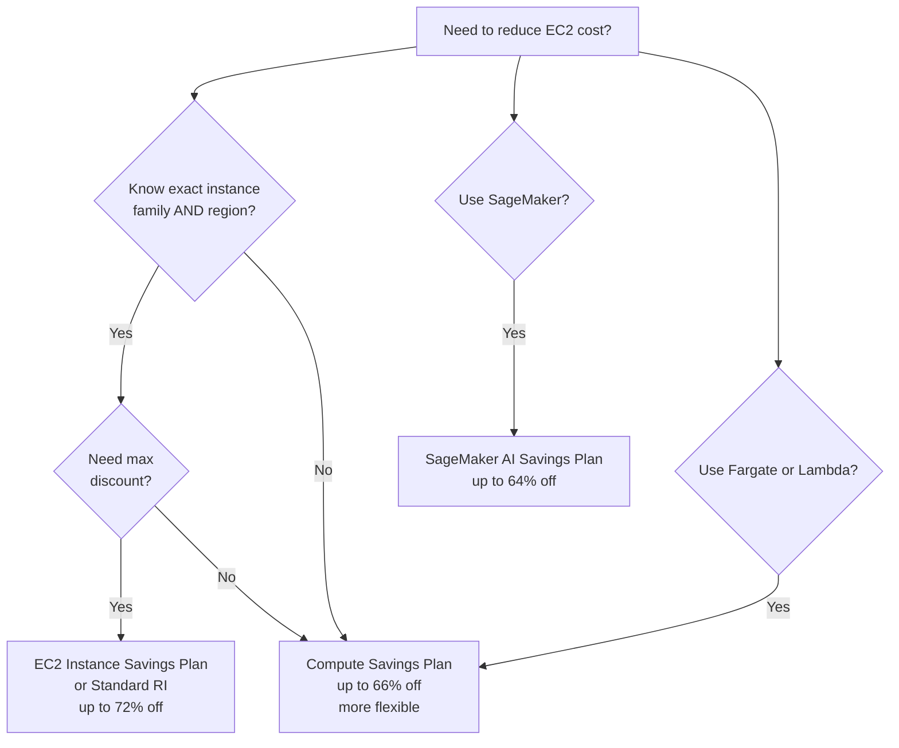
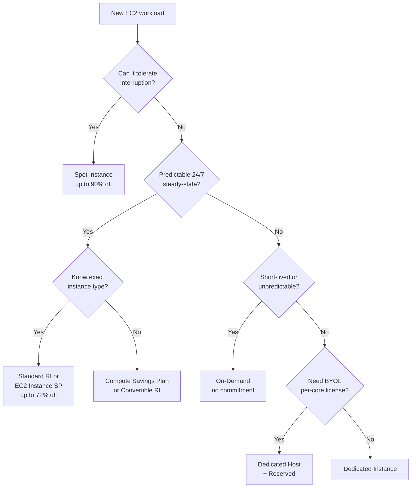
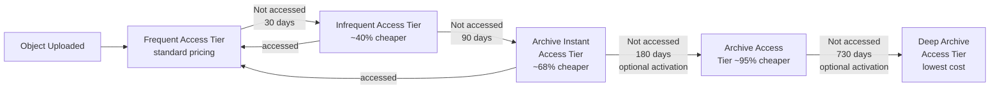
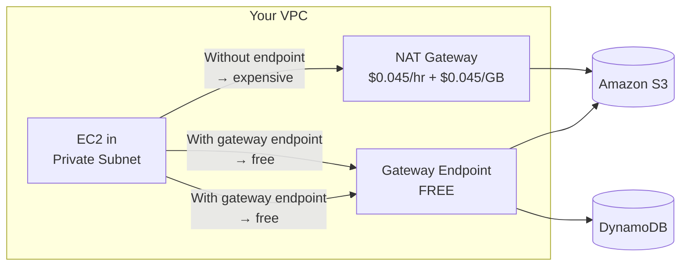
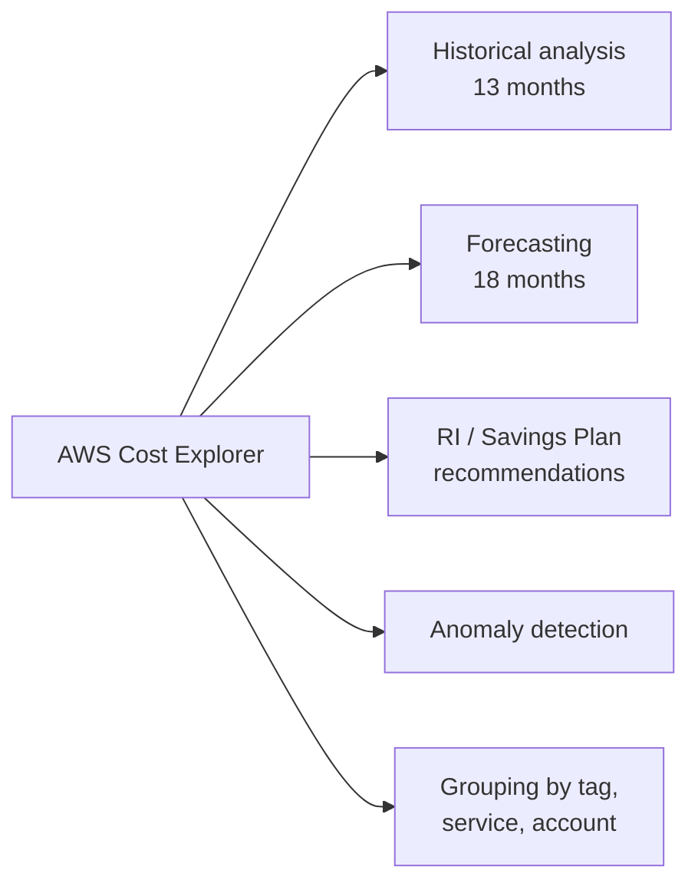

# Domain 4: Design Cost-Optimized Architectures

> **Exam weight: 20% of SAA-C03** — roughly 13 questions out of 65. Scenarios test your ability to pick the cheapest option that still meets stated requirements around availability, performance, and commitment level.

Cost optimization on AWS is not about buying the cheapest thing — it's about matching spending to actual need. AWS gives you levers at every layer: how you buy compute, which storage class you use, how traffic flows through your network, and how you measure and govern all of it.

> **Plain English:** "You have a steady web server running 24/7 — what's cheapest?" → Reserved Instance or Savings Plan. "Batch job that can restart if interrupted?" → Spot. "Logs you never read after 90 days?" → Glacier. "EC2 instances talking to S3 — want to eliminate NAT Gateway bills?" → Gateway VPC Endpoint (free). "Boss wants a weekly email if cloud bill exceeds $500?" → AWS Budget with email alert.

---

## Table of Contents

1. [Compute Pricing Models](#1-compute-pricing-models)
2. [Right-Sizing with AWS Compute Optimizer](#2-right-sizing-with-aws-compute-optimizer)
3. [Cost-Optimized Storage](#3-cost-optimized-storage)
4. [Cost-Optimized Databases](#4-cost-optimized-databases)
5. [Networking and Data Transfer Costs](#5-networking-and-data-transfer-costs)
6. [Cost Management and Governance Tools](#6-cost-management-and-governance-tools)
7. [Glossary](#glossary)
8. [References](#references)

---

## 1. Compute Pricing Models

AWS offers seven ways to purchase EC2 compute. The right choice depends on three questions: **How long will you need it? Can it be interrupted? Can you predict the instance type you'll use?** ([EC2 billing and purchasing options](https://docs.aws.amazon.com/AWSEC2/latest/UserGuide/instance-purchasing-options.html))

### 1.1 On-Demand Instances

Pay **per second** (Linux) or per hour (Windows) for running instances with no long-term commitment. Highest unit price of all options.

- **When to use:** Unpredictable workloads, short-lived experiments, traffic spikes you can't forecast, first time deploying an application before you know utilization patterns.
- **Key trait:** No commitment, no discount. You can start/stop at any time.

### 1.2 Reserved Instances (RI)

A **billing discount** (not a physical reservation unless you choose zonal scope) applied to matching On-Demand usage in exchange for a 1-year or 3-year commitment. Discounts reach up to **72% off On-Demand** pricing. ([Reserved Instances overview](https://docs.aws.amazon.com/AWSEC2/latest/UserGuide/ec2-reserved-instances.html))

#### Offering Classes

| Feature | Standard RI | Convertible RI |
|---|---|---|
| Max discount | Higher (up to ~72%) | Lower (up to ~54%) |
| Can exchange for different instance attributes | No | Yes |
| Can modify (size, AZ within same family) | Yes | Yes |
| Can sell on RI Marketplace | Yes | No |
| Best for | Known, stable workloads | Workloads where instance family may change |

#### Payment Options

| Option | Upfront cost | Hourly charge | Savings vs No Upfront |
|---|---|---|---|
| All Upfront | Full term amount | $0 | Highest savings |
| Partial Upfront | Portion upfront | Reduced hourly | Middle |
| No Upfront | $0 | Discounted hourly | Lowest savings |

> Note: AWS recommends Savings Plans over Reserved Instances for most new commitments due to greater flexibility. ([EC2 RI docs](https://docs.aws.amazon.com/AWSEC2/latest/UserGuide/ec2-reserved-instances.html))

#### Scope: Regional vs Zonal

- **Regional RI** — applies discount across all AZs in a Region for the instance family; no capacity reservation.
- **Zonal RI** — applies to a specific AZ and also **reserves capacity** in that AZ (useful for disaster recovery).

### 1.3 Savings Plans

A commitment to spend a **fixed dollar amount per hour** (e.g., $10/hr) for 1 or 3 years, in exchange for discounted rates. More flexible than RIs because the discount auto-applies as long as you hit the committed spend level. ([What are Savings Plans?](https://docs.aws.amazon.com/savingsplans/latest/userguide/what-is-savings-plans.html))

#### The Four Savings Plan Types

| Plan Type | Max Discount | Applies To | Flexibility |
|---|---|---|---|
| **Compute Savings Plans** | Up to 66% off On-Demand | EC2 (any family/size/OS/region/tenancy), Fargate, Lambda | Maximum — switch instance family, region, OS, or move EC2 → ECS/Lambda freely |
| **EC2 Instance Savings Plans** | Up to 72% off On-Demand | Specific EC2 instance family in a specific Region | Can change size/OS/tenancy within the committed family+Region |
| **SageMaker AI Savings Plans** | Up to 64% off On-Demand | SageMaker instance usage (Training, Inference, Notebooks) | Any family/size/component/region |
| **Database Savings Plans** | Up to 35% off On-Demand | Aurora, RDS, DynamoDB, ElastiCache, DocumentDB, Neptune, and more | Any engine, family, size, AZ, or Region; includes serverless |

([Savings Plans types](https://docs.aws.amazon.com/savingsplans/latest/userguide/plan-types.html))



### 1.4 Spot Instances

Bid on **spare AWS capacity** at up to **90% off On-Demand** pricing. AWS can reclaim Spot Instances with a **2-minute warning** (interruption notice). ([EC2 purchasing options](https://docs.aws.amazon.com/AWSEC2/latest/UserGuide/instance-purchasing-options.html))

#### Interruption Handling

- Configure interruption behavior: **terminate** (default), **stop**, or **hibernate**.
- Use **Spot Instance Advisor** to choose instance types with low interruption frequency.
- **Spot Fleet** — request a mix of instance types and AZs to maintain a target capacity; automatically replaces interrupted instances.
- **EC2 Auto Scaling with mixed instances** — combine On-Demand base capacity with Spot for cost + availability.

#### Ideal Workloads for Spot

- Big data / EMR processing
- CI/CD build pipelines
- Stateless web tier (behind a load balancer)
- Batch jobs / ML training (with checkpointing)
- Video transcoding, image rendering

**Never use Spot for:** databases, stateful applications, anything that cannot tolerate interruption without a checkpoint/restart strategy.

### 1.5 Dedicated Hosts vs Dedicated Instances

| Feature | Dedicated Host | Dedicated Instance |
|---|---|---|
| What you pay for | Entire physical server | Individual instances on single-tenant hardware |
| Visibility into host | Yes (socket, core, VM counts) | No |
| BYOL support | Yes — per-socket or per-core licenses | Limited |
| Can be reserved | Yes (up to 70% savings vs On-Demand host) | Yes |
| Cost model | Per-host billing | Per-instance billing (+ $2/Region/hr fee) |
| Use case | Windows Server, SQL Server, RHEL licenses tied to physical cores | Compliance requiring single-tenant hardware without needing license portability |

([EC2 Dedicated Hosts billing](https://docs.aws.amazon.com/AWSEC2/latest/UserGuide/dedicated-hosts-billing.html))

### 1.6 Pricing Model Decision Tree



### 🎯 On the exam — Compute Pricing

- **"Steady-state 24/7 usage, want maximum discount, know exact instance type"** → Standard Reserved Instance (All Upfront, 3-year) or EC2 Instance Savings Plan.
- **"Fault-tolerant batch processing, cheapest possible"** → Spot Instances.
- **"Unpredictable spike traffic, no commitment"** → On-Demand.
- **"Workload may switch from m5 to c5 or move region"** → Compute Savings Plan (more flexible than RI).
- **"Need to run Windows Server license tied to physical cores"** → Dedicated Host.
- **"Convertible vs Standard RI"** → Standard = higher discount but no exchange; Convertible = can exchange for different attributes, lower discount.
- **"Savings Plans vs RI"** → Savings Plans commit to $/hr spend; RIs commit to specific instance config. AWS now recommends Savings Plans.
- **Trap:** Spot Instances are NOT suitable for RDS, primary databases, or workloads without interruption handling.

---

## 2. Right-Sizing with AWS Compute Optimizer

[AWS Compute Optimizer](https://aws.amazon.com/compute-optimizer/) uses **machine learning on CloudWatch metrics** to identify over-provisioned and under-provisioned resources and recommends optimal configurations.

### What It Analyzes

| Resource | Recommendation Type |
|---|---|
| EC2 instances | Right-size to smaller/larger type, migrate to Graviton |
| EC2 Auto Scaling groups | Adjust desired/min/max capacity |
| EBS volumes | Change volume type (e.g., io1 → gp3) |
| RDS DB instances | Right-size instance class |
| AWS Graviton migration | Estimates performance risk and savings for ARM migration |
| Idle resources | Identify unattached EBS volumes, idle EC2 instances |

### Key Behaviors

- Analyzes **14 days** of CloudWatch metrics by default.
- Requires **opting in** per account (or via AWS Organizations for bulk enrollment).
- Provides **savings opportunity score** and estimated monthly savings.
- Enhanced recommendations available with **CloudWatch Agent** installed (memory utilization data, otherwise CPU-only).
- Can automatically implement recommendations on a recurring schedule.

### 🎯 On the exam — Compute Optimizer

- **"Need to identify over-provisioned EC2 instances"** → AWS Compute Optimizer.
- **"Reduce EC2 spend without changing application"** → Compute Optimizer for right-sizing, then buy Savings Plan/RI for resulting instance type.
- Compute Optimizer ≠ Cost Explorer. Cost Explorer shows spend; Compute Optimizer shows **what to change**.
- **Trap:** Compute Optimizer needs sufficient CloudWatch data (at least 30 hours, recommends 14 days). New instances have no recommendations immediately.

---

## 3. Cost-Optimized Storage

### 3.1 S3 Storage Classes

Choose the storage class based on **access frequency**, **retrieval time requirements**, and **minimum storage duration**. ([S3 storage classes](https://aws.amazon.com/s3/storage-classes/), [S3 storage class docs](https://docs.aws.amazon.com/AmazonS3/latest/userguide/storage-class-intro.html))

| Storage Class | Min Duration | Retrieval Latency | Retrieval Fee | Durability | AZs | Best For |
|---|---|---|---|---|---|---|
| **S3 Standard** | None | Milliseconds | None | 11 9s | ≥3 | Frequently accessed data |
| **S3 Intelligent-Tiering** | None | Milliseconds (auto) | None\* | 11 9s | ≥3 | Unknown/changing access patterns |
| **S3 Standard-IA** | 30 days | Milliseconds | Per GB | 11 9s | ≥3 | Infrequent access, instant retrieval needed |
| **S3 One Zone-IA** | 30 days | Milliseconds | Per GB | 11 9s | 1 | Non-critical infrequent access, ~20% cheaper than Standard-IA |
| **S3 Glacier Instant Retrieval** | 90 days | Milliseconds | Per GB | 11 9s | ≥3 | Archive accessed a few times per year, instant retrieval |
| **S3 Glacier Flexible Retrieval** | 90 days | Minutes–hours | Per GB | 11 9s | ≥3 | Backup/archive, rarely accessed, flexible retrieval |
| **S3 Glacier Deep Archive** | 180 days | 12–48 hours | Per GB | 11 9s | ≥3 | Long-term compliance archive, lowest cost |

\*S3 Intelligent-Tiering has a small monthly **monitoring and automation charge** per object but **no retrieval charges**.

#### S3 Intelligent-Tiering Auto-Tiering Logic



**Key Intelligent-Tiering rules:**
- No retrieval fees — you never pay more for accessing an object in a lower tier.
- No minimum object size requirement (but small objects < 128 KB are not monitored and stay in Frequent Access).
- Objects automatically move back to Frequent Access tier when accessed.

#### S3 Pricing Tier Order (highest to lowest cost per GB stored)

```
S3 Standard > S3 Intelligent-Tiering (Frequent) > S3 Standard-IA > S3 One Zone-IA
> S3 Glacier Instant Retrieval > S3 Glacier Flexible Retrieval > S3 Glacier Deep Archive
```

### 3.2 S3 Lifecycle Policies

[S3 Lifecycle configuration](https://docs.aws.amazon.com/AmazonS3/latest/userguide/object-lifecycle-mgmt.html) automates transitions and deletions without application changes.

**Two action types:**
1. **Transition actions** — move objects to a cheaper storage class after N days.
2. **Expiration actions** — delete objects after N days (or delete old versions, expired delete markers).

**Common lifecycle pattern:**

```
Day 0:    S3 Standard          ← hot data, frequent access
Day 30:   → S3 Standard-IA    ← access frequency drops
Day 90:   → S3 Glacier Flexible Retrieval  ← rarely accessed
Day 365:  → S3 Glacier Deep Archive        ← compliance retention
Day 2555: DELETE               ← end of 7-year retention
```

**Important constraints:**
- You cannot transition from Standard-IA / One Zone-IA to Standard (only downward in tier).
- Minimum 30 days in Standard before transitioning to Standard-IA / One Zone-IA.
- Minimum 30 days in Standard-IA before transitioning to Glacier classes.
- If an object is deleted before its minimum storage duration, you still pay the minimum.

### 3.3 S3 Storage Lens

[S3 Storage Lens](https://docs.aws.amazon.com/AmazonS3/latest/userguide/storage_lens.html) provides organization-wide visibility into object storage usage and activity trends.

- **Free tier:** 28 usage metrics, 14-day data retention.
- **Advanced metrics (paid):** activity metrics, prefix-level metrics, CloudWatch publishing.
- Identifies buckets with large amounts of noncurrent versions, incomplete multipart uploads, and objects in Standard that haven't been accessed — prime candidates for lifecycle rules.

### 3.4 EBS: gp3 vs gp2

[Amazon EBS pricing](https://aws.amazon.com/ebs/pricing/) — gp3 is the current-generation general purpose SSD, replacing gp2.

| Feature | gp2 | gp3 |
|---|---|---|
| Pricing (us-east-1) | ~$0.10/GB-month | ~$0.08/GB-month (~20% cheaper) |
| Baseline IOPS | 3 IOPS/GB (min 100, max 16,000) | **3,000 IOPS included free** |
| Baseline throughput | Up to 250 MB/s (tied to size) | **125 MB/s included free** |
| Max IOPS | 16,000 | 16,000 |
| Max throughput | 250 MB/s | 1,000 MB/s |
| IOPS scaling | Coupled to volume size | **Independently configurable** |
| Additional IOPS cost | N/A (bundled) | ~$0.005/provisioned IOPS-month (above 3,000) |
| Additional throughput cost | N/A | ~$0.04/provisioned MB/s-month (above 125 MB/s) |

**Migration tip:** Most gp2 volumes can be migrated to gp3 with the same or better performance at **lower cost** — no downtime required.

#### EBS Snapshots

- Snapshots are stored in S3 (managed by AWS, not visible in your S3 console).
- Priced per GB-month of data stored; **incremental** — only changed blocks since last snapshot.
- **Data Lifecycle Manager (DLM)** automates snapshot creation, retention, and deletion on schedules.
- Cross-region snapshot copies incur data transfer charges.

### 3.5 EFS Infrequent Access

[Amazon EFS pricing](https://aws.amazon.com/efs/pricing/) offers tiered storage:

| EFS Tier | Use Case | Storage Cost Relative to Standard |
|---|---|---|
| **EFS Standard** | Actively used files, sub-millisecond latency | Baseline |
| **EFS Infrequent Access (IA)** | Files accessed a few times per quarter | ~85–92% cheaper per GB |
| **EFS Archive** | Files accessed a few times per year or less | Cheapest |

- **EFS Lifecycle Management** automatically moves files between tiers based on last-access time (configurable: 7, 14, 30, 60, or 90 days without access → IA).
- Retrieval fee applies when accessing IA/Archive data.
- Works with both **Elastic** (auto-scale throughput) and **Provisioned** throughput modes.

### 🎯 On the exam — Storage

- **"Unknown or changing access patterns"** → S3 Intelligent-Tiering (no retrieval charge, auto-tiering).
- **"Archive accessed only a few times per year, need instant retrieval"** → S3 Glacier Instant Retrieval.
- **"Long-term compliance archive, 7-year retention, retrieval in hours OK"** → S3 Glacier Deep Archive (lowest cost).
- **"Reduce cost of infrequently accessed data but can't tolerate multi-AZ loss"** → S3 One Zone-IA (20% cheaper than Standard-IA, single AZ).
- **"Automate moving S3 objects to cheaper tiers without code changes"** → S3 Lifecycle Policy.
- **"Reduce EBS costs without changing performance"** → Migrate gp2 → gp3 (same IOPS, ~20% cheaper per GB).
- **"Automate EBS snapshot retention"** → Data Lifecycle Manager (DLM).
- **"EFS — files not accessed for 30 days should cost less"** → Enable EFS Lifecycle Management → EFS IA.
- **Trap:** S3 Standard-IA and One Zone-IA have a **30-day minimum storage** — deleting before 30 days still charges you for 30 days. Glacier Instant/Flexible: 90-day minimum. Deep Archive: 180-day minimum.
- **Trap:** One Zone-IA data is in a single AZ — data is **lost** if that AZ is destroyed.

---

## 4. Cost-Optimized Databases

### 4.1 Aurora Serverless v2

[Amazon Aurora Serverless v2](https://aws.amazon.com/rds/aurora/pricing/) scales compute capacity in fine-grained increments of **Aurora Capacity Units (ACUs)**. You pay only for the ACUs used per second.

- **Scale-to-zero:** Aurora Serverless v2 supports scaling down to 0 ACUs during periods of inactivity, eliminating compute cost when the database is idle.
- **Savings vs provisioned:** Up to **90% cost reduction** compared to provisioning for peak load.
- **Use case:** Development/test databases, variable workloads, SaaS applications with unpredictable per-tenant traffic.
- Billed per ACU-hour; storage billed separately per GB-month.

### 4.2 DynamoDB: On-Demand vs Provisioned Capacity

[DynamoDB pricing](https://aws.amazon.com/dynamodb/pricing/) offers two capacity modes: ([DynamoDB docs](https://aws.amazon.com/dynamodb/pricing/))

| Mode | Billing Unit | Best For | Notes |
|---|---|---|---|
| **On-Demand** | Per request (RRU/WRU) | New tables, unpredictable workloads, serverless apps | No capacity planning needed; higher per-request cost |
| **Provisioned + Auto Scaling** | Per provisioned RCU/WCU-hour | Predictable steady-state traffic | Auto Scaling adjusts capacity to target utilization (default 70%) |
| **Reserved Capacity (Provisioned only)** | 1-year or 3-year commitment | Stable baseline throughput | Up to 54% (1-year) or 77% (3-year) discount vs On-Demand |

**DynamoDB Free Tier:** 25 WCUs, 25 RCUs, 25 GB storage per month (does not expire).

**Read unit pricing:**
- Eventually consistent read: 0.5 RRU per 4 KB
- Strongly consistent read: 1 RRU per 4 KB
- Transactional read: 2 RRUs per 4 KB

### 4.3 RDS Reserved Instances

[Amazon RDS Reserved Instances](https://aws.amazon.com/rds/pricing/) follow the same model as EC2 RIs — commit to an instance class, database engine, and Region for 1 or 3 years in exchange for significant discounts vs On-Demand.

- Available in **No Upfront**, **Partial Upfront**, and **All Upfront** options.
- Supports Multi-AZ deployments (separate RI needed for standby if provisioned separately).
- RDS Reserved Instances are a good fit when you have a stable, production database that runs continuously.

### 4.4 Redshift RA3 + Pause/Resume

[Amazon Redshift RA3 nodes](https://aws.amazon.com/redshift/pricing/) **decouple compute from storage** using Redshift Managed Storage (RMS), billed separately:

- **Compute:** Billed per node-hour when the cluster is running.
- **Storage:** Billed per GB-month at a fixed rate (~$0.024/GB-month for RMS) regardless of how much data fits on nodes.
- **Pause/Resume:** For on-demand provisioned clusters, you can pause the cluster to suspend compute billing. During pause, you pay **only for backup storage** — ideal for dev/test clusters used during business hours only.
- RA3 is optimal when your data size exceeds what fits on compute nodes, or when you want to scale compute up/down independently of data size.

### 🎯 On the exam — Databases

- **"Variable database load, don't want to manage capacity"** → Aurora Serverless v2.
- **"DynamoDB — traffic spikes unpredictably"** → On-Demand capacity mode.
- **"DynamoDB — steady, predictable traffic, want to reduce cost"** → Provisioned + Auto Scaling + Reserved Capacity.
- **"RDS MySQL production server running 24/7"** → RDS Reserved Instance (All Upfront, 1 or 3 year).
- **"Redshift cluster only used 8 hours/day during business hours"** → Pause cluster outside hours to stop compute charges.
- **Trap:** Aurora Serverless v2 scale-to-zero requires minimum ACU set to 0 (not the default) — verify this is configured.

---

## 5. Networking and Data Transfer Costs

Data transfer is often the **hidden cost** in AWS architectures. Understanding where charges apply is critical for the exam.

### 5.1 Data Transfer Pricing Rules

([Data transfer cost overview](https://aws.amazon.com/blogs/architecture/overview-of-data-transfer-costs-for-common-architectures/))

| Traffic Type | Cost |
|---|---|
| **Data IN to AWS** (from internet or on-premises) | **Free** |
| **Within same AZ** (between instances) | **Free** |
| **Cross-AZ within same Region** | Charged per GB (~$0.01/GB each direction) |
| **Cross-Region** | Charged per GB (varies by region pair) |
| **To Internet (egress)** | Charged per GB (first 100 GB/month free via Free Tier) |
| **EC2 → S3/DynamoDB in same Region (via IGW)** | Free (stays on AWS network, not internet) |
| **EC2 → S3/DynamoDB via NAT Gateway** | NAT data processing charge applies |
| **EC2 → S3/DynamoDB via Gateway Endpoint** | **Free** (no data processing charge) |
| **AWS services → CloudFront** | **Free** (no origin egress charge) |

### 5.2 NAT Gateway Costs

[NAT Gateway pricing](https://docs.aws.amazon.com/vpc/latest/userguide/nat-gateway-pricing.html):

- **Hourly charge:** Per NAT Gateway-hour provisioned (~$0.045/hr in us-east-1).
- **Data processing charge:** ~$0.045 per GB processed through the NAT Gateway (both inbound and outbound).
- NAT Gateways are regional but exist in a specific AZ — cross-AZ traffic to reach a NAT Gateway also incurs inter-AZ charges.

**Cost reduction strategies:**
1. Create a NAT Gateway in each AZ to avoid cross-AZ charges for resources in that AZ.
2. Use **VPC Gateway Endpoints** for S3 and DynamoDB traffic to eliminate NAT processing charges for those destinations.
3. Use **VPC Interface Endpoints (PrivateLink)** for other AWS services (hourly + per-GB charge, but cheaper than NAT for high-volume traffic to specific services).

### 5.3 VPC Gateway Endpoints (Free)

[Gateway VPC endpoints](https://docs.aws.amazon.com/vpc/latest/privatelink/gateway-endpoints.html) provide connectivity to **Amazon S3** and **Amazon DynamoDB** without requiring a NAT Gateway, Internet Gateway, or VPN.

- **No additional charge** — zero hourly fee, zero data processing fee.
- Traffic routes through AWS's private network (never leaves AWS).
- Configured via route table entries (not DNS-based like interface endpoints).
- Regional only — cannot route to S3/DynamoDB in a different region through a gateway endpoint.



### 5.4 CloudFront to Reduce Egress Costs

[Amazon CloudFront](https://aws.amazon.com/cloudfront/pricing/) caches content at edge locations, reducing the number of requests hitting your origin.

- **Data transfer from AWS origins to CloudFront is free** — no S3 egress charge, no EC2 data transfer charge.
- Data transfer from CloudFront to the internet is charged per GB, but at **lower rates than direct EC2 egress** in most regions.
- CloudFront also reduces origin load, cutting costs for usage-based services (DynamoDB reads, API Gateway calls, Lambda invocations).
- **Free Tier:** 1 TB data transfer out/month + 10 million HTTP/HTTPS requests/month (always free).

**Use CloudFront when:** serving static assets globally, fronting an S3 static website, or reducing EC2/API egress bills.

### 5.5 AWS Direct Connect for High-Volume Transfer

[AWS Direct Connect](https://aws.amazon.com/directconnect/pricing/) provides a dedicated private network connection from your on-premises environment to AWS.

- **Port-hour charge:** Billed per hour the connection is provisioned.
- **Data transfer OUT:** Charged per GB (lower rates than internet egress in most cases).
- **Data transfer IN:** Free.
- **Break-even:** Direct Connect becomes cost-effective when transferring large volumes (typically hundreds of TB/month) that would otherwise be charged at internet egress rates.
- Use Direct Connect when you have predictable, high-volume data transfer needs (e.g., data migration, hybrid cloud with continuous replication).

### 🎯 On the exam — Networking

- **"Private subnet EC2 instances accessing S3 — how to cut NAT Gateway costs?"** → Add a **VPC Gateway Endpoint** for S3 (free, eliminates NAT data processing charges).
- **"Reduce data transfer costs for DynamoDB access from private subnets"** → VPC Gateway Endpoint for DynamoDB (free).
- **"Global users downloading large files from S3 — reduce cost and latency"** → Put CloudFront in front of S3 (free origin egress, cheaper edge delivery).
- **"On-premises → AWS, transferring 500 TB/month — reduce egress costs"** → AWS Direct Connect.
- **"How to avoid cross-AZ NAT Gateway charges"** → Deploy a NAT Gateway in each AZ where you have private subnets.
- **Trap:** VPC Gateway Endpoints only work for S3 and DynamoDB. For other services (e.g., SQS, SSM, Secrets Manager), use Interface Endpoints (PrivateLink) — these have hourly + per-GB charges.
- **Trap:** CloudFront free origin egress applies to data from AWS origins TO CloudFront. The charge for CloudFront to the public internet still applies (just at lower rates).

---

## 6. Cost Management and Governance Tools

### 6.1 AWS Cost Explorer

[AWS Cost Explorer](https://docs.aws.amazon.com/cost-management/latest/userguide/ce-what-is.html) is the primary visualization and analysis tool for AWS spending.

**Key capabilities:**
- View cost and usage data for the **last 13 months**.
- Forecast costs for up to **18 months** into the future (monthly granularity; 3 months at daily granularity).
- Filter and group by service, account, tag, region, instance type, and more.
- Built-in **RI and Savings Plans recommendations** — shows what to purchase based on your usage patterns.
- Detect cost anomalies (powered by ML).
- **Cost Explorer UI:** Free to use.
- **Cost Explorer API:** $0.01 per paginated API request.



### 6.2 AWS Budgets

[AWS Budgets](https://aws.amazon.com/aws-cost-management/aws-budgets/) lets you set custom cost and usage thresholds and receive alerts when you approach or exceed them.

**Budget types:**

| Budget Type | What It Tracks |
|---|---|
| **Cost budget** | Actual or forecasted dollar spend |
| **Usage budget** | Service usage (e.g., EC2 hours, S3 GB) |
| **RI utilization budget** | What % of your Reserved Instances are being used |
| **RI coverage budget** | What % of your usage is covered by Reserved Instances |
| **Savings Plans utilization budget** | How well you're using committed Savings Plan spend |
| **Savings Plans coverage budget** | What % of eligible usage Savings Plans cover |

**Alert options:**
- Threshold: % of budgeted amount (e.g., 80%, 100%, 120% of forecast).
- Notification: Email, SNS topic, or **AWS Chatbot** (Slack/Chime).
- **Budget Actions:** Automatically apply IAM policies, SCP, or stop EC2/RDS instances when a budget is exceeded.

**Free tier:** 2 budgets free per month; each additional budget costs $0.02/day.

### 6.3 Cost and Usage Report (CUR)

[AWS Cost and Usage Reports](https://aws.amazon.com/aws-cost-management/aws-cost-and-usage-reporting/) is the most **granular, comprehensive** billing dataset available.

- Delivered to an **S3 bucket** (your choice) at configurable intervals (hourly, daily, monthly).
- Contains every line-item charge: resource-level detail, pricing terms, tags, reservation discounts.
- Supports **Athena**, **Redshift**, and **QuickSight** integration for analytics.
- The source of truth for cost allocation, chargeback, and showback.
- Unlike Cost Explorer (UI/API), CUR is a **raw data export** — you query it yourself.

**CUR vs Cost Explorer:**

| Feature | Cost Explorer | CUR |
|---|---|---|
| Interface | UI + API | Raw CSV/Parquet in S3 |
| Granularity | Hourly/daily/monthly | Hourly resource-level |
| Use case | Ad-hoc analysis, forecasting | Detailed BI, chargeback, automation |
| Cost | Free UI; $0.01/API request | S3 storage cost only |
| Historical data | 13 months | As long as you store it |

### 6.4 AWS Trusted Advisor

[AWS Trusted Advisor](https://aws.amazon.com/premiumsupport/trustedadvisor/) provides automated best-practice checks across six pillars, including cost optimization.

**Cost optimization checks include:**
- Idle EC2 instances
- Underutilized EBS volumes
- Unassociated Elastic IP addresses
- Low-utilization Amazon RDS instances
- Underutilized Reserved Instances
- S3 buckets with incomplete multipart uploads

**Access tiers:**
- **All accounts:** 56 checks (basic security, service limits, some cost checks).
- **Business Support and above:** 482 total checks (full cost optimization, performance, fault tolerance checks) + Trusted Advisor API.
- **Enterprise Support:** Trusted Advisor **Priority** — proactive recommendations from your AWS account team.

### 6.5 Cost Allocation Tags

[Cost Allocation Tags](https://docs.aws.amazon.com/awsaccountbilling/latest/aboutv2/cost-alloc-tags.html) allow you to categorize AWS resources by business dimensions (project, team, environment, cost center) and track costs per tag in Cost Explorer and CUR.

**Two tag types:**
1. **AWS-generated tags** (e.g., `aws:createdBy`) — automatically applied, must be activated.
2. **User-defined tags** (e.g., `project:payments-api`, `env:prod`) — you create and apply these to resources.

**Workflow:**
1. Apply tags to all AWS resources at creation time.
2. Activate tags in the Billing console (takes up to 24 hours to appear in reports).
3. Filter Cost Explorer by tag to see spend per team/project.
4. Use in CUR for detailed chargeback reports.

**Enforcement:** Use AWS Config rules or tag policies (via AWS Organizations) to enforce tagging standards.

### 6.6 AWS Organizations and Consolidated Billing

[AWS Organizations consolidated billing](https://docs.aws.amazon.com/organizations/latest/userguide/orgs_introduction.html) combines all member accounts under a single **management account** for billing.

**Benefits:**
- **Single invoice** for all accounts.
- **Volume discounts aggregate** — S3, EC2 data transfer, and other services with tiered pricing pool usage across all accounts, potentially reaching lower price tiers sooner.
- **Reserved Instance and Savings Plan sharing** — RIs and Savings Plans purchased in one account automatically apply to matching usage in other accounts in the organization (unless sharing is disabled).
- Use [Service Control Policies (SCPs)](https://docs.aws.amazon.com/organizations/latest/userguide/orgs_manage_policies_scps.html) to enforce governance (e.g., prevent purchasing expensive instance types, require tags).

### 6.7 Billing Alarms (CloudWatch)

Before AWS Budgets existed, **CloudWatch Billing Alarms** were the standard alerting mechanism.

- Billing metrics are published to CloudWatch in the **us-east-1 (N. Virginia)** region only.
- Set an alarm on `EstimatedCharges` metric (total account bill).
- Trigger SNS notification (→ email, SMS, Lambda).
- Must enable "Receive Billing Alerts" in Account Settings.

**CloudWatch Billing Alarm vs AWS Budgets:**

| | CloudWatch Billing Alarm | AWS Budgets |
|---|---|---|
| Granularity | Total account charges only | Per service, tag, RI, Savings Plan |
| Forecast alerts | No | Yes |
| Budget Actions | No | Yes (auto-apply SCPs, stop instances) |
| Cost | CloudWatch standard pricing | 2 free; $0.02/day per additional |
| Recommendation | Legacy approach | Preferred modern approach |

### 🎯 On the exam — Cost Management Tools

- **"Visualize spend over time, forecast next 6 months"** → AWS Cost Explorer.
- **"Alert when monthly bill exceeds $1,000"** → AWS Budgets (cost budget with actual threshold).
- **"Line-item detail for every AWS charge, feed into BI tool"** → Cost and Usage Report (CUR) → S3 → Athena/QuickSight.
- **"Identify idle EC2 instances and underutilized RDS"** → AWS Trusted Advisor (requires Business Support for full checks).
- **"Right-size EC2 instances based on actual utilization"** → AWS Compute Optimizer.
- **"Multiple teams using same AWS account — track cost per team"** → Cost Allocation Tags + Cost Explorer.
- **"Multiple AWS accounts — share Reserved Instances across accounts"** → AWS Organizations consolidated billing (RI sharing enabled by default).
- **Trap:** Cost Explorer shows spend history and forecasts but does NOT show which instance types to change — that's Compute Optimizer.
- **Trap:** Trusted Advisor full cost checks require **Business Support or higher** — Basic/Developer support only gets 56 checks.
- **Trap:** CloudWatch Billing Alarms are only visible in **us-east-1** — you must switch to N. Virginia to configure them.
- **Trap:** Reserved Instances are shared across AWS Organizations accounts by default — buying an RI in the management account can apply to member account usage. If you don't want sharing, disable it.

---

## Glossary

| Term | Simple Explanation | Purpose |
|---|---|---|
| **On-Demand Instance** | Pay per second, no commitment | Maximum flexibility; highest unit price |
| **Reserved Instance (RI)** | Billing discount for committing to a specific instance config for 1–3 years | Reduce cost for steady workloads |
| **Standard RI** | RI that can be modified but not exchanged | Highest RI discount; for known, stable workloads |
| **Convertible RI** | RI that can be exchanged for different attributes | Flexibility to change instance family; slightly lower discount |
| **Savings Plan** | Commit to $/hr usage for 1–3 years; discount auto-applies | Flexible alternative to RIs |
| **Compute Savings Plan** | Most flexible Savings Plan; covers EC2, Fargate, Lambda | Change anything — family, region, OS, service |
| **EC2 Instance Savings Plan** | Commit to specific instance family + region | Highest SP discount; less flexible |
| **Spot Instance** | Bid on unused EC2 capacity; up to 90% off; can be interrupted | Fault-tolerant, interruptible batch workloads |
| **Spot Fleet** | Group of Spot (+ optionally On-Demand) instances to meet target capacity | Maintain capacity despite individual interruptions |
| **Dedicated Host** | Entire physical server for your use; BYOL support | Per-socket/core software licensing compliance |
| **Dedicated Instance** | Instance on single-tenant hardware; no host visibility | Compliance requiring single-tenant hardware |
| **AWS Compute Optimizer** | ML-based right-sizing recommendations for EC2, EBS, RDS, ASGs | Identify over/under-provisioned resources |
| **S3 Standard** | Default S3 storage; frequent access, no min duration | General-purpose object storage |
| **S3 Standard-IA** | Infrequent access; millisecond retrieval; 30-day minimum | Data accessed monthly, needs fast retrieval |
| **S3 One Zone-IA** | Standard-IA but single AZ; ~20% cheaper | Non-critical data tolerating AZ loss |
| **S3 Intelligent-Tiering** | Auto-moves objects between tiers based on access; no retrieval fee | Unknown/unpredictable access patterns |
| **S3 Glacier Instant Retrieval** | Archive with millisecond retrieval; 90-day minimum | Rarely accessed archive needing instant reads |
| **S3 Glacier Flexible Retrieval** | Archive; 1–5 min expedited or 5–12 hr bulk; 90-day min | Backup/archive; retrieval hours OK |
| **S3 Glacier Deep Archive** | Lowest cost; 12–48 hr retrieval; 180-day minimum | Long-term compliance archive |
| **S3 Lifecycle Policy** | Rules to auto-transition or delete S3 objects over time | Automate cost reduction as data ages |
| **S3 Storage Lens** | Organization-wide S3 usage visibility dashboard | Identify waste and optimization opportunities |
| **EBS gp3** | Current-gen SSD; 3,000 IOPS + 125 MB/s included; cheaper than gp2 | Cost-effective general-purpose block storage |
| **Data Lifecycle Manager (DLM)** | Automates EBS snapshot creation and retention | Reduce manual snapshot management cost |
| **EFS Infrequent Access (IA)** | Lower-cost EFS tier for files not accessed recently | Reduce NFS storage costs for cold files |
| **Aurora Serverless v2** | Aurora that scales by ACU per second; can scale to 0 | Variable-load databases without over-provisioning |
| **DynamoDB On-Demand** | Pay per request; no capacity planning | Unpredictable DynamoDB traffic |
| **DynamoDB Provisioned** | Set read/write capacity in advance; auto-scaling available | Predictable, steady DynamoDB traffic |
| **Redshift RA3** | Redshift node type with separate compute/managed storage billing | Scale compute and storage independently |
| **Redshift Pause/Resume** | Stop compute billing for idle clusters; pay only storage | Dev/test clusters used part-time |
| **VPC Gateway Endpoint** | Free private connectivity to S3 and DynamoDB within VPC | Eliminate NAT Gateway cost for S3/DynamoDB |
| **NAT Gateway** | Managed NAT for private subnets; charged per hour + per GB | Outbound internet for private subnets |
| **CloudFront** | CDN; free origin egress from AWS; caches at edge | Reduce origin load and egress costs |
| **AWS Direct Connect** | Dedicated private network link to AWS | High-volume, consistent hybrid connectivity |
| **AWS Cost Explorer** | UI/API for visualizing 13 months of history + 18-month forecast | Ad-hoc spend analysis and RI/SP recommendations |
| **AWS Budgets** | Custom cost/usage/RI/SP thresholds with alerts and actions | Proactive cost alerting and automated responses |
| **Cost and Usage Report (CUR)** | Hourly line-item detail delivered to S3 | Detailed BI, chargeback, compliance |
| **AWS Trusted Advisor** | Automated best-practice checks; full cost checks need Business Support | Identify cost waste, security gaps, limits |
| **Cost Allocation Tags** | Key-value tags on resources that appear in billing reports | Track spend by team, project, environment |
| **Consolidated Billing** | Single bill for all AWS Organizations accounts | Aggregate volume discounts, share RIs/SPs |
| **CloudWatch Billing Alarm** | Legacy alert on total estimated charges; us-east-1 only | Simple threshold alert on total bill |

---

## References

- [Amazon EC2 Billing and Purchasing Options](https://docs.aws.amazon.com/AWSEC2/latest/UserGuide/instance-purchasing-options.html) — Official EC2 pricing options overview
- [EC2 Reserved Instances Overview](https://docs.aws.amazon.com/AWSEC2/latest/UserGuide/ec2-reserved-instances.html) — Standard vs Convertible, payment options, scope
- [What are AWS Savings Plans?](https://docs.aws.amazon.com/savingsplans/latest/userguide/what-is-savings-plans.html) — Savings Plans introduction and commitment model
- [Savings Plans Types](https://docs.aws.amazon.com/savingsplans/latest/userguide/plan-types.html) — Compute, EC2 Instance, SageMaker AI, Database Savings Plans with discount levels
- [EC2 Purchasing Options Decision Guide](https://docs.aws.amazon.com/decision-guides/latest/ec2-purchasing-options-aws-how-to-choose/ec2-purchasing-options-aws-how-to-choose.html) — AWS official how-to-choose guide
- [Amazon EC2 Dedicated Host Billing](https://docs.aws.amazon.com/AWSEC2/latest/UserGuide/dedicated-hosts-billing.html) — Dedicated Host pricing and BYOL details
- [AWS Compute Optimizer](https://aws.amazon.com/compute-optimizer/) — Right-sizing and optimization recommendations
- [Amazon S3 Storage Classes](https://aws.amazon.com/s3/storage-classes/) — All storage class overview with use cases
- [S3 Storage Class Documentation](https://docs.aws.amazon.com/AmazonS3/latest/userguide/storage-class-intro.html) — Detailed S3 storage class technical reference
- [Amazon S3 Intelligent-Tiering](https://aws.amazon.com/s3/storage-classes/intelligent-tiering/) — Auto-tiering for unknown access patterns
- [S3 Glacier Storage Classes](https://docs.aws.amazon.com/AmazonS3/latest/userguide/glacier-storage-classes.html) — Glacier Instant, Flexible, Deep Archive
- [Managing the Lifecycle of Objects](https://docs.aws.amazon.com/AmazonS3/latest/userguide/object-lifecycle-mgmt.html) — S3 Lifecycle policies, transitions, expirations
- [Amazon EBS Pricing](https://aws.amazon.com/ebs/pricing/) — gp2 vs gp3 pricing comparison
- [Amazon EFS Pricing](https://aws.amazon.com/efs/pricing/) — EFS Standard vs IA vs Archive pricing
- [Amazon Aurora Pricing](https://aws.amazon.com/rds/aurora/pricing/) — Aurora Serverless v2 ACU pricing
- [Amazon DynamoDB Pricing](https://aws.amazon.com/dynamodb/pricing/) — On-demand vs provisioned capacity models
- [Amazon RDS Reserved Instances](https://docs.aws.amazon.com/AmazonRDS/latest/AuroraUserGuide/USER_WorkingWithReservedDBInstances.html) — RDS RI purchasing options
- [Amazon Redshift Pricing](https://aws.amazon.com/redshift/pricing/) — RA3 nodes, managed storage, pause/resume
- [NAT Gateway Pricing](https://docs.aws.amazon.com/vpc/latest/userguide/nat-gateway-pricing.html) — Hourly and data processing charges
- [VPC Gateway Endpoints](https://docs.aws.amazon.com/vpc/latest/privatelink/gateway-endpoints.html) — Free S3/DynamoDB private connectivity
- [Data Transfer Costs for Common Architectures](https://aws.amazon.com/blogs/architecture/overview-of-data-transfer-costs-for-common-architectures/) — Architecture blog on data transfer pricing
- [Well-Architected: Implement Services to Reduce Data Transfer Costs](https://docs.aws.amazon.com/wellarchitected/latest/cost-optimization-pillar/cost_data_transfer_implement_services.html) — Cost Optimization Pillar guidance
- [Amazon CloudFront Pricing](https://aws.amazon.com/cloudfront/pricing/) — Edge delivery pricing and free origin egress
- [AWS Cost Explorer](https://docs.aws.amazon.com/cost-management/latest/userguide/ce-what-is.html) — 13-month history, 18-month forecast, RI recommendations
- [AWS Budgets](https://aws.amazon.com/aws-cost-management/aws-budgets/) — Cost, usage, RI, Savings Plans budgets with alerts
- [AWS Cost and Usage Reports](https://aws.amazon.com/aws-cost-management/aws-cost-and-usage-reporting/) — Granular billing data export
- [Organizing Costs with Cost Allocation Tags](https://docs.aws.amazon.com/awsaccountbilling/latest/aboutv2/cost-alloc-tags.html) — Tag-based cost tracking
- [AWS Trusted Advisor](https://aws.amazon.com/premiumsupport/trustedadvisor/) — Automated best-practice checks and support tiers
- [AWS Cost Management — What Is Billing and Cost Management?](https://docs.aws.amazon.com/cost-management/latest/userguide/what-is-costmanagement.html) — Overview of all cost management tools
- [SAA-C03 Exam Guide](https://d1.awsstatic.com/training-and-certification/docs-sa-assoc/AWS-Certified-Solutions-Architect-Associate_Exam-Guide.pdf) — Official exam domain weightings and scope

---

*Part of the [AWS Solutions Architect Associate course](README.md) · SAA-C03.*
