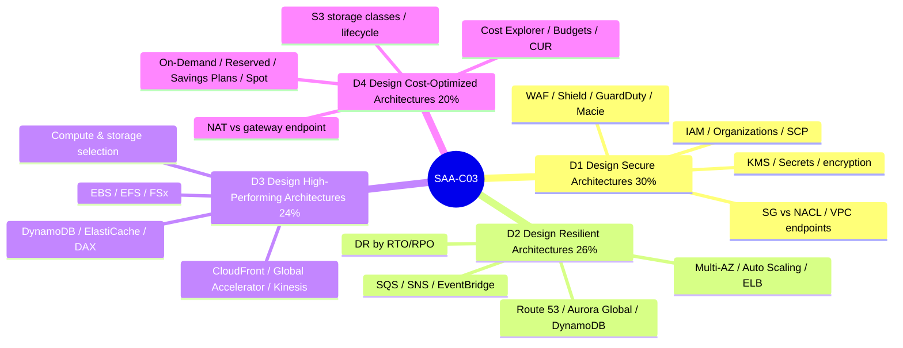
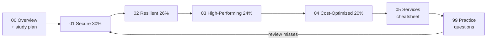

# AWS Solutions Architect – Associate (SAA-C03) — Study Course

A complete, intuition-first course for passing the **AWS Certified Solutions Architect – Associate (SAA-C03)** exam. It teaches the exam the way it's actually structured — by the **four design goals** (secure, resilient, high-performing, cost-optimized) — with mental models, mermaid diagrams, the exact "🎯 On the exam" traps AWS uses, and a scenario-based practice bank.

| | 🟠 **Solutions Architect – Associate** |
|---|---|
| **Exam code** | SAA-C03 |
| **Level** | Associate |
| **Who it's for** | Anyone who *designs* systems on AWS — architects, engineers, developers, platform/ops |
| **Format** | Multiple choice (1 of 4) + multiple response (2+ of 5) |
| **Questions** | 65 (50 scored + 15 unscored) |
| **Time** | 130 minutes |
| **Passing score** | **720** / 1000 (scaled; ≈ 72%) |
| **Scoring** | Compensatory — pass the overall exam, no per-domain minimum |
| **Cost** | $150 USD |
| **Validity** | 3 years |
| **Prereqs** | None (≈ 1 year hands-on AWS experience recommended) |

Sources: [SAA-C03 exam guide](https://docs.aws.amazon.com/aws-certification/latest/solutions-architect-associate-03/solutions-architect-associate-03.html) · [SAA-C03 exam guide (PDF)](https://d1.awsstatic.com/training-and-certification/docs-sa-assoc/AWS-Certified-Solutions-Architect-Associate_Exam-Guide_C03.pdf) · [Official certification page](https://aws.amazon.com/certification/certified-solutions-architect-associate/)

---

## The four domains

| # | Domain | Weight | Study page |
|---|---|---|---|
| 1 | Design Secure Architectures | **30%** | [01 — Design Secure Architectures](01-design-secure-architectures.md) |
| 2 | Design Resilient Architectures | **26%** | [02 — Design Resilient Architectures](02-design-resilient-architectures.md) |
| 3 | Design High-Performing Architectures | **24%** | [03 — Design High-Performing Architectures](03-design-high-performing-architectures.md) |
| 4 | Design Cost-Optimized Architectures | **20%** | [04 — Design Cost-Optimized Architectures](04-design-cost-optimized-architectures.md) |

**Domains 1 + 2 are 56% of the exam** — security and resilience. Weight your study accordingly.

---

## Course map

- **[00 — Exam Overview & Study Plan](00-exam-overview-and-study-plan.md)** — blueprint coverage, 5–6 week plan, exam-day tactics.
- **[01 — Design Secure Architectures (30%)](01-design-secure-architectures.md)** — IAM, Organizations/SCP, KMS, Secrets Manager, SG vs NACL, VPC endpoints, WAF/Shield, GuardDuty/Inspector/Macie, S3 security.
- **[02 — Design Resilient Architectures (26%)](02-design-resilient-architectures.md)** — Multi-AZ, Auto Scaling, ELB, SQS/SNS/EventBridge, DR strategies, Route 53, Aurora Global Database, DynamoDB global tables, S3 replication.
- **[03 — Design High-Performing Architectures (24%)](03-design-high-performing-architectures.md)** — compute/storage/database selection, EBS/EFS/FSx, ElastiCache/DAX, CloudFront vs Global Accelerator, Kinesis & analytics.
- **[04 — Design Cost-Optimized Architectures (20%)](04-design-cost-optimized-architectures.md)** — pricing models, S3 storage classes & lifecycle, data-transfer/NAT cost, Aurora Serverless, cost management tools.
- **[05 — Core Services Cheatsheet](05-core-services-cheatsheet.md)** — "what / when to use" for every tested service + a big **"if you see X → pick Y"** disambiguation table.
- **[99 — Practice Questions](99-practice-questions.md)** — 58 scenario questions with per-distractor explanations + a score guide.

---

## Suggested study order

> **Tip:** Read a domain page → skim the [cheatsheet](05-core-services-cheatsheet.md) rows for the services it covers → do that domain's [practice questions](99-practice-questions.md). Repeat. Before exam day, re-read only the cheatsheet's **"if you see X → pick Y"** table and every **🎯 On the exam** callout.

---

*Part of [ai-system-design-guide](../README.md). Grounded in the official AWS exam guide and AWS documentation, with sources cited on every page. AWS changes services frequently — confirm against [AWS docs](https://docs.aws.amazon.com/) before exam day.*
