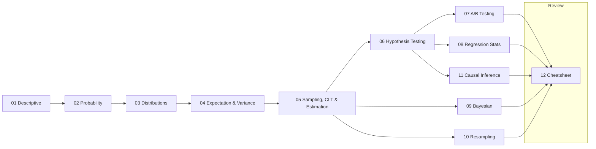

# Statistics for Data Science

A comprehensive, interview-focused statistics reference — every topic a data-science, ML, quant, or research interview tests, built from first principles with plain-English mental models, worked examples, `Why / When to use / Nuances` callouts, and an **"🎯 In the interview"** trap list on every major topic.

> **In plain English:** Statistics is the discipline of reasoning under uncertainty — quantifying what you can conclude from data and how confident you're allowed to be. Interviewers use it as a hard filter: you can't run an A/B test, trust a model, or defend a metric without it. This section makes the concepts *click*, then drills the exact traps interviewers set.

> **How this relates to the summary page:** The single-page [Statistics & Probability summary](../20-machine-learning-foundations/03-statistics-and-probability.md) in ML Foundations is a fast refresher. **This section goes deep** — one thorough page per topic area.

---

## Course map

| # | Page | Covers |
|---|---|---|
| 1 | [Descriptive Statistics](01-descriptive-statistics.md) | central tendency, spread, percentiles/z-scores, skew/kurtosis, outliers, correlation (Pearson/Spearman/Kendall), visual summaries, sample vs population |
| 2 | [Probability Fundamentals](02-probability-fundamentals.md) | axioms, conditional probability, independence, Bayes' theorem, combinatorics, random variables, expectation/variance rules, probability fallacies |
| 3 | [Probability Distributions](03-probability-distributions.md) | every discrete & continuous distribution — what it models, mean/variance, when to use, and how they relate |
| 4 | [Expectation, Variance & Relationships](04-expectation-variance-and-relationships.md) | expectation/LOTUS, variance, covariance/correlation, variance of sums, conditional expectation, MGFs, Jensen/Chebyshev, bias–variance |
| 5 | [Sampling, CLT & Estimation](05-sampling-clt-and-estimation.md) | sampling methods & bias, standard error, LLN, CLT, MLE/MAP/MoM, confidence intervals |
| 6 | [Hypothesis Testing](06-hypothesis-testing.md) | H0/H1, p-values, Type I/II errors, power, effect size, and every major test (t, z, ANOVA, chi-square, non-parametric) |
| 7 | [A/B Testing & Experimental Design](07-ab-testing-and-experimental-design.md) | design, power/sample size, MDE, peeking, multiple testing, SRM, CUPED, sequential & Bayesian testing, quasi-experiments |
| 8 | [Regression & Correlation Statistics](08-regression-and-correlation-statistics.md) | OLS assumptions, coefficient inference, R²/adjusted, multicollinearity/VIF, heteroscedasticity, logistic regression stats |
| 9 | [Bayesian Statistics](09-bayesian-statistics.md) | priors/likelihood/posterior, conjugacy, credible intervals, Bayes factors, Bayesian vs frequentist, MCMC intuition |
| 10 | [Resampling, Bootstrap & Monte Carlo](10-resampling-bootstrap-and-monte-carlo.md) | bootstrap, jackknife, permutation tests, cross-validation as resampling, Monte Carlo |
| 11 | [Causal Inference & Biases](11-causal-inference-and-biases.md) | correlation≠causation, confounding, Simpson's paradox, RCTs, DiD/PSM/IV/RDD, DAGs, colliders, data biases |
| — | [Statistics Interview Cheatsheet](12-statistics-interview-cheatsheet.md) | rapid "if you see X → answer Y" table, distributions at a glance, ~20 Q&A, top formulas, top traps |

---

## Suggested study order

> **Tip:** Pages 01→06 are the backbone (descriptive → probability → distributions → expectation → sampling/estimation → testing). A/B testing (07), regression stats (08), Bayesian (09), resampling (10), and causal inference (11) build on that backbone. Before an interview, re-read the [cheatsheet](12-statistics-interview-cheatsheet.md) and every **🎯 In the interview** callout.

---

## The highest-yield reflexes

- **Skewed data → report median + IQR, not mean.**
- **P(A|B) ≠ P(B|A)** — the base-rate fallacy sinks candidates on medical-test questions.
- **CLT** is about the sampling distribution of the *statistic*, not the data.
- **A 95% confidence interval** does *not* mean "95% probability the parameter is in *this* interval" (that's a Bayesian **credible interval**).
- **p < 0.05** says nothing about effect *size* or importance; failing to reject H0 ≠ proving H0.
- **Peeking / early-stopping** an A/B test inflates false positives; many comparisons need a **multiple-testing correction** (Bonferroni / Benjamini-Hochberg).
- **R²** always rises with more features → use **adjusted R²**; a significant coefficient isn't causal without a valid design.
- **Correlation ≠ causation**; watch for **confounders**, **Simpson's paradox**, and never condition on a **collider**.

---

*Part of the [ai-system-design-guide](../README.md). Formulas and definitions are verified against authoritative sources (NIST/SEMATECH e-Handbook, standard texts) with references on each page.*
